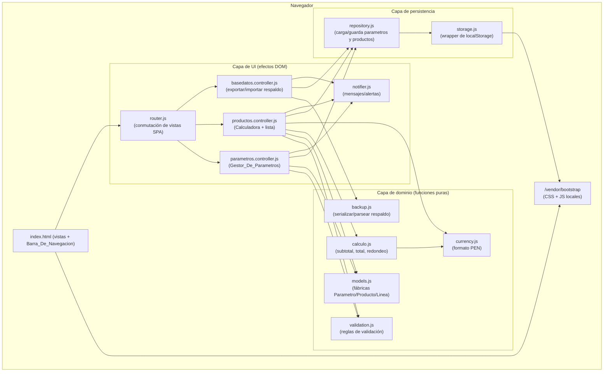

# Design Document

## Overview

La Aplicacion es una aplicación web de una sola página (SPA) que se ejecuta por completo en el navegador del usuario, sin servidor, sin framework y sin ningún paso de empaquetado o compilación (build). Consiste, como mínimo, en un archivo `index.html` que carga estilos y componentes de **Bootstrap alojados localmente** (sin CDN, cero solicitudes de red externas) y ejecuta toda la lógica en JavaScript "vanilla".

La Aplicacion se abre con **doble clic sobre `index.html`** bajo el Protocolo_De_Archivo (`file://`), sin necesidad de levantar un servidor. Por ello, la lógica JavaScript se carga mediante **Scripts_Clasicos** (etiquetas `<script src="...">` sin `type="module"`) que comparten su API a través de un **espacio de nombres global** en lugar de usar `import`/`export` de Módulos ES resueltos por el navegador. Esto es una restricción crítica: bajo `file://` el navegador bloquea la resolución de Módulos ES por `fetch`, por lo que el uso de `<script type="module">` con `import`/`export` en tiempo de ejecución impediría que la Aplicacion arranque con doble clic.

La Aplicacion ofrece sus capacidades organizadas en tres vistas conmutables desde una barra de navegación superior:

1. **Pagina_Productos** (vista de inicio por defecto): la Calculadora dinámica (nombre del producto, líneas de cálculo con selector de parámetro + cantidad, botón calcular que muestra subtotales por línea y total en PEN con 2 decimales, y guardado del producto) más la lista de Productos guardados (nombre + Precio_Total).
2. **Pagina_Parametros**: el Gestor_De_Parametros (crear, editar y eliminar Parametros con nombre, precio unitario en PEN y unidad) más la lista de Parametros guardados (nombre, precio, unidad).
3. **Pagina_Base_De_Datos**: la gestión de respaldo de datos. Permite **exportar** todos los datos guardados en `localStorage` (Parametros y Productos) a un Archivo_De_Respaldo en formato JSON descargable, y **importar** un Archivo_De_Respaldo para reemplazar los datos actuales y restaurar la información entre sesiones o dispositivos.

Las colecciones de Parametros y Productos se persisten en `localStorage` en formato JSON bajo claves estables, de modo que la información sobrevive entre sesiones. La Pagina_Base_De_Datos opera sobre esas mismas claves versionadas para producir y consumir un respaldo portable.

### Decisiones de diseño clave

- **JavaScript vanilla con Scripts_Clasicos y espacio de nombres global**: no se introduce ningún framework ni paso de empaquetado/build. Bajo el Protocolo_De_Archivo (`file://`) el navegador bloquea la resolución de Módulos ES por `fetch`, por lo que NO se usan `<script type="module">` con `import`/`export`. En su lugar, cada archivo de `src/` se carga como un Script_Clasico (`<script src="...">` sin `type="module"`) y adjunta su API a un **objeto global compartido** (por ejemplo, `window.LP = window.LP || {}`, con submódulos como `LP.calculo`, `LP.validation`, `LP.repository`, `LP.currency`, `LP.models`, `LP.backup`, `LP.storage`, `LP.router`, `LP.notifier`). Cada archivo consume sus dependencias leyéndolas de ese mismo espacio de nombres global. El **orden de las etiquetas `<script>` en `index.html` respeta las dependencias**: primero el dominio puro (currency, calculo, validation, models, backup), luego la persistencia (storage, repository), luego la infraestructura de UI (notifier, router), luego los controladores, y finalmente `app.js`. Esto elimina la necesidad de build tooling y mantiene el requisito de cero dependencias de red externas (Requisito 7), permitiendo abrir la Aplicacion con doble clic sobre `index.html` sin servidor (Requisitos 7.3, 7.4).
- **Encapsulación por IIFE para evitar colisiones en el ámbito global**: dado que los Scripts_Clasicos comparten un único ámbito global, cada archivo de `src/` DEBE envolver su cuerpo en una IIFE (`(function () { ... })();` o `(function (global) { ... })(window);`) de modo que sus identificadores internos (constantes y funciones auxiliares como `MENSAJES`, `IDS`, `formatearPEN`, `crearProducto`, etc.) queden privados y NO se declaren en el ámbito global. Lo único que sale de la IIFE es la publicación de la API en `window.LP` (p. ej. `window.LP.currency = { formatearPEN }`), y las dependencias se leen de `window.LP.*` dentro de la IIFE. Sin esta encapsulación, dos archivos que declaren el mismo identificador de nivel superior (p. ej. `MENSAJES` en `validation.js` y en `productos.controller.js`, o `IDS` en dos controladores) provocan un `SyntaxError: Identifier has already been declared` que detiene la ejecución de todos los scripts e impide el arranque de la Aplicacion (dejando, por ejemplo, la Barra_De_Navegacion sin cablear). `calculo.js` ya sigue este patrón. (Requisitos 7.3, 7.4)
- **Separación entre lógica pura y efectos de UI/almacenamiento**: el cálculo (redondeo, subtotales, total) y la validación se implementan como funciones puras sin dependencia del DOM ni de `localStorage`. Esto mantiene el dominio aislado y fácil de razonar, independientemente de la capa de UI.
- **Conmutación de vistas estilo SPA**: un único `index.html` contiene las tres vistas; un enrutador ligero muestra/oculta secciones sin recargas ni solicitudes de red (Requisitos 7.3, 8).
- **Respaldo con lógica pura separada de los efectos de E/S**: la serialización y el parseo/validación del Archivo_De_Respaldo se implementan como funciones puras (`backup.js`), sin dependencia del DOM ni de `localStorage`. La descarga del archivo (Blob/URL) y la lectura del archivo importado (FileReader) quedan aisladas en el controlador de vista (`basedatos.controller.js`), lo que mantiene el formato y la validación del respaldo separados de la UI (Requisito 9).
- **Persistencia tolerante a fallos**: la capa de almacenamiento nunca lanza errores hacia la UI; ante JSON corrupto, ausencia de datos o fallo de escritura devuelve un resultado explícito que la UI traduce en un mensaje (Requisito 6).

## Architecture

La Aplicacion sigue una arquitectura por capas dentro del navegador, con una separación estricta entre la lógica pura (dominio) y las capas que producen efectos (almacenamiento y UI).



### Flujo de arranque (Requisitos 6.3, 6.4, 6.5, 8.2)

1. `index.html` carga el CSS de Bootstrap local, el marcado de las tres vistas y los archivos JS mediante Scripts_Clasicos (`<script src="...">` sin `type="module"`), en orden de dependencias: primero el dominio puro, luego la persistencia, luego la infraestructura de UI y los controladores, y finalmente `app.js`. Cada archivo publica su API en el espacio de nombres global (`window.LP`).
2. El archivo de arranque (`app.js`), tras cargarse el último, invoca `LP.repository.load()` para leer Parametros y Productos.
3. Si el almacenamiento está vacío, se inicia con listas vacías. Si el JSON está corrupto, se inician listas vacías, se conserva el contenido original y `notifier` muestra un mensaje de carga fallida.
4. El router muestra la Pagina_Productos como vista de inicio y renderiza ambas listas.

### Flujo de cálculo (Requisitos 3, 4, 5)

1. El usuario ingresa el nombre del producto y agrega Lineas_De_Calculo (selector de Parametro + cantidad).
2. Al presionar **Calcular**, `productos.controller` valida nombre, existencia de al menos una línea, cantidad y parámetro seleccionado por línea usando `validation.js`.
3. Si es válido, invoca `calculo.js` para obtener subtotales y total, y los muestra formateados con `currency.js`.
4. Al **Guardar**, `repository.saveProducto()` persiste el Producto.

### Flujo de exportación (Requisitos 9.1, 9.2)

1. El usuario presiona **Exportar** en la Pagina_Base_De_Datos.
2. `basedatos.controller` obtiene los Parametros y Productos actuales (desde `repository.load()`) e invoca `backup.serializarRespaldo(parametros, productos)` para obtener la cadena JSON del Archivo_De_Respaldo (con campo de versión).
3. El controlador crea un `Blob` con esa cadena, genera una URL con `URL.createObjectURL` y dispara la descarga; luego libera la URL con `URL.revokeObjectURL`.

### Flujo de importación (Requisitos 9.3–9.7)

1. El usuario selecciona un archivo mediante el control **Importar** (input de tipo archivo).
2. `basedatos.controller` lee el contenido con `FileReader` e invoca `backup.parsearRespaldo(texto)`, que devuelve un `ParseResult`.
3. Si el resultado es `invalid` (JSON inválido o estructura incorrecta), el controlador muestra `notifier.error` con el mensaje de archivo inválido y **no** modifica el Almacenamiento_Local (Requisito 9.6).
4. Si el resultado es `ok`, el controlador solicita confirmación explícita con `notifier.confirmar` advirtiendo que se reemplazarán los datos actuales (Requisito 9.4).
   - Si el usuario **cancela**, no se modifica nada (Requisito 9.7).
   - Si el usuario **confirma**, invoca `repository.saveParametros` y `repository.saveProductos` (o `repository.replaceAll`) con los datos importados y refresca todas las vistas (Requisito 9.5).

## Components and Interfaces

Todas las firmas se describen con notación tipo TypeScript por claridad; la implementación es JavaScript vanilla. Cada archivo se carga como un Script_Clasico y **expone su API en el espacio de nombres global** `window.LP` (por ejemplo, `LP.storage`, `LP.repository`, `LP.calculo`, etc.) en lugar de usar `export`, y **consume sus dependencias leyéndolas de ese mismo espacio de nombres global** en lugar de usar `import`. Las firmas de las funciones no cambian por ello.

### `storage.js` — Wrapper de localStorage

Encapsula el acceso a `localStorage` y traduce fallos en resultados explícitos (nunca lanza hacia arriba).

```ts
type ReadResult<T> =
  | { status: "ok"; value: T }
  | { status: "empty" }
  | { status: "corrupt"; raw: string };

type WriteResult =
  | { status: "ok" }
  | { status: "failed"; reason: "unavailable" | "quota" | "unknown" };

function readJSON<T>(key: string): ReadResult<T>;
function writeJSON(key: string, value: unknown): WriteResult;
```

- `readJSON` devuelve `empty` si la clave no existe, `corrupt` (con el `raw` original preservado) si `JSON.parse` falla, `ok` con el valor en caso contrario.
- `writeJSON` captura excepciones (`QuotaExceededError`, almacenamiento no disponible) y devuelve `failed` sin sobrescribir el estado en memoria.

### `repository.js` — Repositorio de dominio

Media entre el dominio y `storage.js`. Mantiene claves estables:

```ts
const KEY_PARAMETROS = "limpiapipas.parametros.v1";
const KEY_PRODUCTOS  = "limpiapipas.productos.v1";

interface LoadResult {
  parametros: Parametro[];
  productos: Producto[];
  warnings: string[]; // p. ej. "parametros corruptos", "productos corruptos"
}

function load(): LoadResult;
function saveParametros(parametros: Parametro[]): WriteResult;
function saveProductos(productos: Producto[]): WriteResult;
function replaceAll(parametros: Parametro[], productos: Producto[]): WriteResult; // reemplazo atómico usado por la importación (Requisito 9.5)
```

- `load` combina los dos `readJSON`; ante `corrupt` o `empty` devuelve la lista correspondiente vacía y agrega un warning cuando corresponde (Requisitos 6.4, 6.5).
- Las funciones de guardado devuelven el `WriteResult` para que el controlador muestre un mensaje si falla (Requisito 6.6).
- `replaceAll` guarda ambas colecciones (Parametros y Productos) a las claves versionadas de una sola operación; internamente reutiliza `saveParametros` y `saveProductos`. Lo emplea la importación de respaldo para reemplazar todos los datos actuales por los importados (Requisito 9.5). Devuelve un `WriteResult` combinado (`failed` si alguna escritura falla).

### `models.js` — Fábricas de entidades

```ts
function crearParametro(nombre: string, precioUnitario: number, unidad: string): Parametro;
function crearProducto(nombre: string, lineas: LineaDeCalculo[], precioTotal: number): Producto;
function crearLinea(parametroId: string | null, cantidad: number | null): LineaDeCalculo;
function generarId(): string; // id estable único (p. ej. crypto.randomUUID)
```

### `validation.js` — Reglas de validación (funciones puras)

```ts
interface ValidationResult { valido: boolean; mensaje?: string; }

function validarNombreParametro(nombre: string, existentes: Parametro[], idEnEdicion?: string): ValidationResult; // 1..100, único
function validarPrecioUnitario(valor: unknown): ValidationResult; // número 0.00..999999999.99, máx 2 decimales
function validarUnidad(unidad: string): ValidationResult; // 1..20
function validarNombreProducto(nombre: string): ValidationResult; // 1..100 (tras trim, no solo espacios)
function validarCantidad(valor: unknown): ValidationResult; // número 0.01..999999999.99, máx 2 decimales
```

Cada función devuelve el `mensaje` exacto que exige el criterio de aceptación asociado (Requisitos 1.2–1.5, 3.2, 3.3, 4.4, 5.5, 5.6).

### `calculo.js` — Cálculo (funciones puras)

```ts
function redondear2(n: number): number;               // half-up a 2 decimales
function subtotalLinea(cantidad: number, precioUnitario: number): number; // redondeado a 2 decimales
function precioTotal(subtotales: number[]): number;    // suma redondeada a 2 decimales
function calcularProducto(lineas: LineaResuelta[]): { subtotales: number[]; total: number };
```

Donde `LineaResuelta` es una línea con `cantidad` y `precioUnitario` ya resueltos desde el Parametro referenciado.

### `currency.js` — Formato de moneda (función pura)

```ts
function formatearPEN(n: number): string; // "S/ 1234.50" con exactamente 2 decimales
```

### `router.js` — Enrutador SPA

```ts
type Vista = "productos" | "parametros" | "basedatos";
function mostrar(vista: Vista): void; // muestra una sección, oculta las demás; sin recargas ni red
function vistaInicial(): void;        // muestra "productos" (Requisito 8.2)
```

- `mostrar(vista)` muestra la sección indicada y oculta las otras dos (Requisitos 8.3, 8.4, 8.5).
- `vistaInicial()` sigue mostrando la Pagina_Productos como vista de inicio predeterminada (Requisito 8.2).

### `backup.js` — Serialización y parseo del respaldo (funciones puras)

Implementa la lógica pura del Archivo_De_Respaldo, sin dependencia del DOM ni de `localStorage`. La descarga y la lectura de archivos las realiza `basedatos.controller.js`.

```ts
const BACKUP_VERSION = "1"; // alineado con las claves .v1

type ParseResult =
  | { status: "ok"; parametros: Parametro[]; productos: Producto[] }
  | { status: "invalid"; reason: string };

function serializarRespaldo(parametros: Parametro[], productos: Producto[]): string; // JSON con { version, parametros, productos }
function parsearRespaldo(texto: string): ParseResult;                                 // parseo + validación de estructura
```

- `serializarRespaldo` produce la cadena JSON del Archivo_De_Respaldo con el campo `version` y las colecciones `parametros` y `productos`, compatible con las claves `limpiapipas.parametros.v1` y `limpiapipas.productos.v1` (Requisitos 9.1, 9.2).
- `parsearRespaldo` intenta `JSON.parse(texto)` y valida la estructura esperada (objeto con `parametros` y `productos` que sean arreglos, y un campo `version`). Si el texto no es JSON válido o no cumple la estructura, devuelve `{ status: "invalid", reason }` sin lanzar excepciones (Requisito 9.6). En caso correcto devuelve `{ status: "ok", parametros, productos }`.

### `basedatos.controller.js` — Exportar/Importar respaldo (efectos DOM)

Controlador de la Pagina_Base_De_Datos. Cablea los controles de exportación e importación y coordina `backup`, `repository` y `notifier`. Concentra todos los efectos de E/S del navegador (Blob, `URL.createObjectURL`, `FileReader`).

- **Exportar**: al presionar el botón, obtiene las colecciones actuales, invoca `backup.serializarRespaldo`, crea un `Blob` de tipo `application/json`, genera una URL con `URL.createObjectURL` y dispara la descarga del Archivo_De_Respaldo; luego libera la URL con `URL.revokeObjectURL` (Requisitos 9.1, 9.2).
- **Importar**: al seleccionar un archivo, lo lee con `FileReader` y llama a `backup.parsearRespaldo`.
  - `status === "invalid"` → `notifier.error` con el mensaje de archivo inválido; no altera el Almacenamiento_Local (Requisito 9.6).
  - `status === "ok"` → `notifier.confirmar` advirtiendo el reemplazo (Requisito 9.4). Si el usuario confirma, invoca `repository.replaceAll` (o `saveParametros` + `saveProductos`) con los datos importados y refresca las vistas (lista de Parametros, lista de Productos y estado de la Calculadora) (Requisito 9.5). Si cancela, no hace nada (Requisito 9.7).

### `parametros.controller.js` — Gestor_De_Parametros (efectos DOM)

Renderiza el formulario y la lista de Parametros; gestiona crear/editar/eliminar. Coordina `validation`, `models`, `repository` y `notifier`. Implementa la confirmación de eliminación cuando el Parametro está referenciado por líneas de la Calculadora, indicando cuántas líneas se afectan y marcándolas como "sin parámetro" al confirmar (Requisito 2.4).

### `productos.controller.js` — Calculadora + lista de Productos (efectos DOM)

Gestiona el nombre del producto, agregar/eliminar líneas, el selector de Parametro por línea (mostrando la Unidad asociada), el cálculo y el guardado, y la renderización de la lista de Productos guardados.

### `notifier.js` — Mensajes de UI

```ts
function info(mensaje: string): void;
function error(mensaje: string): void;
function confirmar(mensaje: string): boolean; // confirmación explícita (Requisito 2.4)
```

## Data Models

### Parametro

```ts
interface Parametro {
  id: string;              // identificador único estable
  nombre: string;          // 1..100 caracteres, único (case-sensitive tras trim)
  precioUnitario: number;  // 0.00..999999999.99, máx 2 decimales (PEN)
  unidad: string;          // 1..20 caracteres (p. ej. "UND", "MIN")
}
```

### LineaDeCalculo

```ts
interface LineaDeCalculo {
  parametroId: string | null; // referencia a Parametro.id; null => "sin parámetro"
  cantidad: number | null;    // 0.01..999999999.99, máx 2 decimales
  subtotal: number;           // cantidad * precioUnitario, redondeado a 2 decimales
}
```

### Producto

```ts
interface Producto {
  id: string;                 // identificador único estable
  nombre: string;             // 1..100 caracteres
  lineas: LineaDeCalculo[];   // >= 1 línea al guardar
  precioTotal: number;        // suma de subtotales, redondeada a 2 decimales
}
```

### Forma persistida en localStorage

- Clave `limpiapipas.parametros.v1` → `Parametro[]` serializado como JSON.
- Clave `limpiapipas.productos.v1` → `Producto[]` serializado como JSON.

El sufijo de versión (`.v1`) permite futuras migraciones sin romper datos existentes.

### Archivo_De_Respaldo (forma del respaldo exportado/importado)

```ts
interface ArchivoDeRespaldo {
  version: string;         // versión del formato de respaldo, alineada con las claves .v1
  parametros: Parametro[]; // corresponde a la clave limpiapipas.parametros.v1
  productos: Producto[];   // corresponde a la clave limpiapipas.productos.v1
}
```

- `serializarRespaldo` produce esta forma serializada como JSON; `parsearRespaldo` la valida al importar (Requisitos 9.1, 9.2).
- La estructura reúne en un único objeto todos los datos del Almacenamiento_Local (Parametros + Productos) más el campo `version`, lo que permite exportar un respaldo portable e importarlo para restaurar los datos.

### Reglas de redondeo (Requisito 5)

- `subtotalLinea(cantidad, precioUnitario)` = `redondear2(cantidad * precioUnitario)` con redondeo half-up.
- `precioTotal(subtotales)` = `redondear2(sum(subtotales))`.
- El redondeo half-up a 2 decimales se implementa de forma robusta frente a errores de punto flotante (por ejemplo, redondeando sobre un valor escalado con corrección de épsilon), no con `toFixed` ingenuo.

## Error Handling

La estrategia de manejo de errores separa los errores de validación (esperados, controlados por el usuario) de los fallos de infraestructura (almacenamiento, recursos).

### Validación de entradas (Requisitos 1, 3, 4, 5)

- Toda entrada se valida con funciones puras de `validation.js` antes de mutar el estado o persistir.
- Cada `ValidationResult` inválido incluye el `mensaje` exacto exigido por el criterio de aceptación, que el controlador muestra mediante `notifier.error`.
- Al rechazar, se conserva el estado en edición (nombre del producto, líneas y cantidades ya ingresadas) sin registrar el valor inválido (Requisitos 3.2, 3.3, 4.4).
- El cálculo agrega múltiples verificaciones (sin líneas, cantidad inválida, parámetro no seleccionado) y muestra el mensaje correspondiente a la primera condición incumplida detectada (Requisitos 5.4, 5.5, 5.6).

### Eliminación de parámetros referenciados (Requisito 2.4)

- Antes de eliminar un Parametro, el controlador cuenta cuántas Lineas_De_Calculo del producto en edición lo referencian.
- Si hay al menos una, solicita confirmación explícita indicando el número de líneas afectadas (`notifier.confirmar`).
- Al confirmarse, marca esas líneas con `parametroId = null` (sin parámetro) y luego elimina el Parametro.

### Persistencia (Requisito 6)

| Situación | Detección | Respuesta |
|-----------|-----------|-----------|
| Almacenamiento vacío | `readJSON` devuelve `empty` | Iniciar con lista vacía (6.4) |
| JSON corrupto | `JSON.parse` lanza | Iniciar con lista vacía, preservar el `raw` original, mostrar mensaje de carga fallida (6.5) |
| Escritura falla (quota/no disponible) | Excepción en `setItem` | Conservar datos en memoria de la sesión, mostrar mensaje de guardado no persistente (6.6) |

`storage.js` nunca propaga excepciones a la UI: siempre devuelve un resultado tipado (`ReadResult` / `WriteResult`) que los controladores traducen a mensajes.

### Importación de respaldo (Requisito 9)

- El parseo del Archivo_De_Respaldo se realiza con la función pura `backup.parsearRespaldo`, que nunca lanza: ante JSON inválido o estructura incorrecta devuelve `{ status: "invalid", reason }`.
- Cuando `parsearRespaldo` devuelve `invalid`, `basedatos.controller` muestra `notifier.error` con el mensaje de archivo inválido y **conserva sin cambios** los Parametros y Productos del Almacenamiento_Local (Requisito 9.6).
- Cuando el parseo es `ok`, se solicita **confirmación explícita** con `notifier.confirmar` advirtiendo que la importación reemplazará los datos actuales (Requisito 9.4).
- Si el usuario **cancela** la confirmación, no se realiza ninguna escritura y los datos permanecen intactos (Requisito 9.7).
- Solo tras la confirmación se invoca `repository.replaceAll`; si esa escritura falla (quota/no disponible), aplica el mismo manejo de persistencia de la tabla anterior (mensaje de guardado no persistente, Requisito 6.6).

### Fallo de carga de Bootstrap (Requisito 7.5)

- Si el CSS local de Bootstrap no carga, la aplicación permanece funcional (marcado semántico y JS operativos, con las tres páginas en estado usable) y muestra una indicación visible de que los estilos no se cargaron. Se detecta comprobando la aplicación de una regla conocida de Bootstrap tras la carga.

### Apertura bajo el Protocolo_De_Archivo sin Módulos ES (Requisitos 7.3, 7.4)

- La lógica se carga con Scripts_Clasicos (`<script src="...">` sin `type="module"`) que publican su API en el espacio de nombres global `window.LP`, de modo que la Aplicacion arranca al abrir `index.html` con doble clic bajo `file://` sin depender de la resolución de Módulos ES por `fetch` (que el navegador bloquea en ese esquema) ni de un servidor.
- Cada archivo de `src/` encapsula su cuerpo en una IIFE para que sus identificadores internos no colisionen en el ámbito global compartido por los Scripts_Clasicos; publicar dos veces el mismo identificador de nivel superior aborta la carga con un `SyntaxError` e impide el arranque (Requisitos 7.3, 7.4).

## Mapeo de secciones de diseño a requisitos

| Sección de diseño | Requisitos cubiertos |
|-------------------|----------------------|
| Overview / Architecture | 6, 7, 8 (arquitectura SPA, Bootstrap local, Scripts_Clasicos con espacio de nombres global, apertura con doble clic bajo `file://` sin Módulos ES, arranque) — incluye 7.3, 7.4 |
| Components — `validation.js` | 1.2–1.5, 2.3, 3.2–3.4, 4.3, 4.4, 5.5, 5.6 |
| Components — `calculo.js`, `currency.js` | 5.1, 5.2, 5.3 |
| Components — `repository.js`, `storage.js` | 6.1–6.6 |
| Components — `parametros.controller.js` | 1.1, 1.6, 1.7, 2.1, 2.2, 2.4 |
| Components — `productos.controller.js` | 3.1, 4.1, 4.2, 4.5–4.7, 5.4, 8.7 |
| Components — `router.js` | 7.3, 8.1–8.5 |
| Components — `backup.js` | 9.1, 9.2, 9.6 |
| Components — `basedatos.controller.js` | 9.1–9.7 |
| Data Models | 1, 3, 4, 5, 6, 9 (formas de Parametro, Producto, Linea; forma persistida; Archivo_De_Respaldo) |
| Error Handling | 2.4, 3.2, 3.3, 4.4, 5.4–5.6, 6.4–6.6, 7.3, 7.4, 7.5, 9.4–9.7 |

## Estructura de archivos del proyecto

```
/
├── index.html                     # Único punto de entrada: vistas + Barra_De_Navegacion
├── vendor/
│   └── bootstrap/
│       ├── bootstrap.min.css      # Bootstrap CSS local (sin CDN)
│       └── bootstrap.bundle.min.js# Bootstrap JS local (sin CDN)
├── src/
│   ├── app.js                     # Arranque: carga datos, inicializa router y controladores
│   ├── router.js                  # Conmutación de vistas SPA
│   ├── storage.js                 # Wrapper de localStorage (ReadResult/WriteResult)
│   ├── repository.js              # Carga/guarda parametros y productos (claves estables)
│   ├── models.js                  # Fábricas de entidades e ids
│   ├── validation.js              # Reglas de validación (funciones puras)
│   ├── calculo.js                 # Subtotal, total, redondeo (funciones puras)
│   ├── currency.js                # Formato PEN (función pura)
│   ├── backup.js                  # Serializar/parsear Archivo_De_Respaldo (funciones puras)
│   ├── notifier.js                # Mensajes y confirmaciones de UI
│   ├── parametros.controller.js   # Gestor_De_Parametros (efectos DOM)
│   ├── productos.controller.js    # Calculadora + lista de Productos (efectos DOM)
│   └── basedatos.controller.js    # Exportar/Importar respaldo (efectos DOM)
└── styles/
    └── app.css                    # Estilos propios adicionales
```

Toda ruta a Bootstrap y a los archivos JS es relativa al origen local del proyecto, garantizando cero solicitudes de red externas (Requisitos 7.1, 7.2). No se requiere build tooling ni dependencias de desarrollo: los archivos de `src/` se cargan como **Scripts_Clasicos** (`<script src="...">` sin `type="module"`) en el **orden de sus dependencias** (primero el dominio puro — currency, calculo, validation, models, backup —, luego la persistencia — storage, repository —, luego la infraestructura de UI — notifier, router —, luego los controladores, y finalmente `app.js`) y cada uno publica su API en el espacio de nombres global `window.LP`. Esto permite abrir la Aplicacion con doble clic sobre `index.html` bajo el Protocolo_De_Archivo (`file://`) sin servidor y sin Módulos ES (Requisitos 7.3, 7.4).
