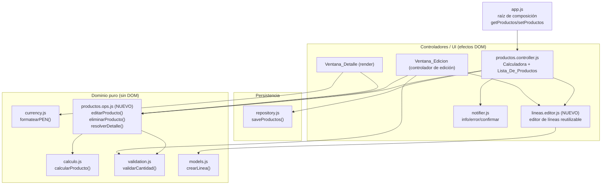

# Design Document

## Overview

Esta funcionalidad amplía la Pagina_Productos para permitir **Ver detalle**, **Editar** y **Eliminar** los Productos guardados desde la Lista_De_Productos. El diseño se apoya estrictamente en la arquitectura existente de la Aplicacion Limpiapipas: JavaScript vanilla puro, HTML y CSS, sin framework, sin empaquetado, ejecución bajo el Protocolo_De_Archivo (`file://`) y carga de la lógica mediante Scripts_Clasicos que publican sus APIs en el espacio de nombres global `window.LP`. La interfaz está en español y la moneda es soles (PEN).

El principio rector del diseño es **reutilizar, no duplicar**. La Calculadora ya implementa toda la mecánica de agregar/eliminar/seleccionar Lineas_De_Calculo, mostrar la Unidad y validar cantidades/parámetros en `productos.controller.js`. La Ventana_Edicion debe usar exactamente ese mismo mecanismo (Requisito 3.3), por lo que el diseño extrae esa lógica de edición de líneas a un módulo reutilizable (`lineas.editor.js`) que consumen tanto la Calculadora principal como la Ventana_Edicion.

Puntos clave que ya están cubiertos por la base y **no requieren cambios**:

- **Persistencia y restauración de sesión (Requisito 5.4)**: `app.js` ya carga los Productos al arrancar vía `repository.load()`. Al persistir la lista completa con `repository.saveProductos()`, las ediciones y eliminaciones se restauran automáticamente en la siguiente sesión.
- **Exportación/importación (Requisito 6)**: `backup.serializarRespaldo(parametros, productos)` y `backup.parsearRespaldo(texto)` ya operan sobre el arreglo `productos`. Mientras las ediciones y eliminaciones muten la única fuente de verdad (el arreglo `productos` compartido por `app.js`), el respaldo reflejará automáticamente el estado actualizado. **No se requieren cambios en `backup.js` ni en `basedatos.controller.js`.**

En consecuencia, el trabajo se concentra en: (1) la Lista_De_Productos con tres acciones por Producto, (2) la Ventana_Detalle de solo lectura, (3) la Ventana_Edicion reutilizando el editor de líneas, y (4) las operaciones puras de edición/eliminación sobre la lista de Productos.

## Architecture

### Capas y ubicación de los cambios

La Aplicacion mantiene su separación entre lógica pura (funciones sin DOM, testeable de forma unitaria y por propiedades) y controladores (efectos DOM, cableado defensivo que degrada si el DOM está ausente). Este diseño respeta esa separación:



### Nuevos módulos y modificaciones

| Archivo | Tipo | Responsabilidad |
| --- | --- | --- |
| `src/productos.ops.js` | **NUEVO** — dominio puro | Operaciones puras sobre la lista de Productos: `editarProducto(productos, id, lineasProducto)`, `eliminarProducto(productos, id)`, `resolverDetalle(producto, parametros)`. Sin DOM ni persistencia. |
| `src/lineas.editor.js` | **NUEVO** — UI reutilizable | Editor de Lineas_De_Calculo extraído de la Calculadora: renderiza filas (selector de Parametro, Unidad, cantidad, botón eliminar), agrega/elimina líneas, muestra la indicación de estado vacío y expone la lista en edición. Consumido por la Calculadora y por la Ventana_Edicion. |
| `src/productos.controller.js` | **MODIFICADO** | (a) usar `lineas.editor.js` en lugar de su lógica de líneas interna; (b) renderizar los tres botones por Producto en `renderListaProductos()`; (c) cablear las acciones Ver detalle / Editar / Eliminar; (d) gestionar la Ventana_Detalle y la Ventana_Edicion. |
| `index.html` | **MODIFICADO** | Añadir el marcado estático de los dos modales de Bootstrap y los nuevos `<script>` en orden de dependencias. |
| `backup.js`, `basedatos.controller.js`, `repository.js`, `app.js` | **SIN CAMBIOS** | La persistencia y el respaldo ya operan sobre el arreglo `productos`. |

### Orden de carga de scripts (`index.html`)

Los Scripts_Clasicos se cargan en orden de dependencias. Los nuevos módulos se insertan así:

```
1. Dominio puro:  currency.js, calculo.js, validation.js, models.js,
                  productos.ops.js (NUEVO — depende de calculo/validation), backup.js
2. Persistencia:  storage.js, repository.js
3. UI:            notifier.js, router.js, lineas.editor.js (NUEVO — depende de models)
4. Controladores: parametros.controller.js, productos.controller.js (usa lineas.editor + productos.ops),
                  basedatos.controller.js
5. Arranque:      app.js
```

### Decisión de diseño: modales de Bootstrap

Se verificó que `index.html` carga `vendor/bootstrap/bootstrap.bundle.min.js`, que incluye la API `bootstrap.Modal`. Por tanto:

- **Decisión**: usar marcado estático de modales en `index.html` y controlarlos con la API `bootstrap.Modal` (`new bootstrap.Modal(el)`, `.show()`, `.hide()`).
- **Rationale**: es coherente con el uso de clases de Bootstrap ya presente en la Aplicacion y evita construir el DOM del modal dinámicamente. El marcado estático es más simple de mantener y accesible por defecto (foco, `aria`, cierre con Escape).
- **Degradación segura (bajo `file://`)**: el controlador comprueba `typeof window.bootstrap !== "undefined" && window.bootstrap.Modal`. Si la API no está disponible (p. ej. el bundle no cargó), recurre a un control manual mínimo: alternar la clase `d-none` sobre el contenedor del modal y un `backdrop` propio. Así la funcionalidad de Ver detalle/Editar no depende estrictamente de que el JS de Bootstrap se haya cargado, en línea con la tolerancia a fallos del Requisito 7.4 de la base. Las confirmaciones de eliminación siguen usando `notifier.confirmar` (`window.confirm`), como el resto de la Aplicacion.

## Components and Interfaces

### 1. `productos.ops.js` (dominio puro — NUEVO)

Funciones puras que no tocan el DOM ni la persistencia. Reciben y devuelven datos inmutables (no mutan sus entradas).

```js
// window.LP.productosOps

/**
 * Devuelve una NUEVA lista de Productos con el Producto de id `id` reemplazado
 * por una versión con las nuevas líneas, subtotales recalculados y Precio_Total
 * recalculado. Conserva el id y el nombre originales. El resto de Productos se
 * conserva sin cambios y en el mismo orden. Si no existe el id, devuelve una
 * copia de la lista sin cambios.
 *
 * @param {Producto[]} productos
 * @param {string} id
 * @param {Array<{parametroId: string|null, cantidad: number, subtotal: number}>} lineasProducto
 * @returns {Producto[]}
 */
function editarProducto(productos, id, lineasProducto) { /* ... */ }

/**
 * Devuelve una NUEVA lista de Productos sin el Producto de id `id`. El resto se
 * conserva sin cambios y en el mismo orden. Si no existe el id, devuelve una
 * copia de la lista sin cambios.
 *
 * @param {Producto[]} productos
 * @param {string} id
 * @returns {Producto[]}
 */
function eliminarProducto(productos, id) { /* ... */ }

/**
 * Resuelve las líneas de un Producto para su visualización de solo lectura,
 * mapeando cada parametroId al nombre y unidad del Parametro vigente. Si el
 * Parametro no existe o parametroId es null, marca la línea como "ausente"
 * (nombre = Nombre_Parametro_Ausente, unidad = ""), conservando el subtotal
 * almacenado tal cual (Req 2.4).
 *
 * @param {Producto} producto
 * @param {Parametro[]} parametros
 * @returns {{ nombre: string, precioTotal: number,
 *             lineas: Array<{ nombreParametro: string, ausente: boolean,
 *                             cantidad: number, unidad: string, subtotal: number }> }}
 */
function resolverDetalle(producto, parametros) { /* ... */ }
```

- `editarProducto` recalcula usando `calculo.calcularProducto()` a partir de las líneas resueltas (cantidad + precioUnitario del Parametro), asigna los subtotales a cada línea y el total al `precioTotal` (Req 3.5, 5.1–5.2 base). La validación de las líneas ocurre **antes** en el controlador; `editarProducto` asume líneas ya válidas.
- Constante exportada `NOMBRE_PARAMETRO_AUSENTE = "Parámetro no disponible"` para el texto Nombre_Parametro_Ausente (Req 2.4).

### 2. `lineas.editor.js` (UI reutilizable — NUEVO)

Extrae de `productos.controller.js` la lógica de edición de líneas hoy contenida en `agregarLinea`, `eliminarLinea`, `renderLineas`, `construirFilaLinea`, `actualizarUnidad` y `aNumeroCantidad`. Se instancia con un contenedor DOM y accesores de Parametros; mantiene su propio estado de líneas en edición.

```js
// window.LP.lineasEditor.crearEditorDeLineas(opciones) -> EditorDeLineas

/**
 * @param {Object} opciones
 * @param {HTMLElement} opciones.contenedor        Nodo donde renderizar las filas.
 * @param {() => Parametro[]} opciones.getParametros Accesor a los Parametros vigentes.
 * @param {HTMLElement} [opciones.botonAgregar]     Botón "Agregar línea" a cablear (opcional).
 */
function crearEditorDeLineas(opciones) { /* ... */ }

/**
 * @typedef {Object} EditorDeLineas
 * @property {() => void} render                 Renderiza las filas o el estado vacío.
 * @property {() => void} agregarLinea           Agrega una línea vacía y re-renderiza.
 * @property {(indice:number) => void} eliminarLinea
 * @property {(lineas:Array) => void} setLineas  Carga líneas iniciales (deep copy).
 * @property {() => Array} getLineas             Devuelve las líneas en edición actuales.
 * @property {(parametroId:string) => number} contarLineasQueReferencian
 * @property {(parametroId:string) => void} desreferenciarParametro
 */
```

- El editor **no** valida ni calcula: solo captura la entrada del usuario (parametroId por línea y cantidad cruda) y expone `getLineas()`. La validación y el cálculo los realiza el consumidor (Calculadora o Ventana_Edicion) reutilizando las MENSAJES y `productos.ops`/`calculo`.
- La Calculadora principal pasa a ser un consumidor del editor con `contenedor = #lineas-container` y `botonAgregar = #btn-agregar-linea`. Las funciones de módulo `contarLineasQueReferencian`/`desreferenciarParametro` que hoy expone `productos.controller.js` para la coordinación con `parametros.controller.js` (Req 2.4 base) delegan en el editor de la Calculadora.

### 3. Lista_De_Productos con acciones (`productos.controller.js` — MODIFICADO)

`renderListaProductos()` se amplía para renderizar por cada Producto: nombre, Precio_Total en PEN (`formatearPEN`, 2 decimales) y tres botones (Req 1.1). Estado vacío sin botones (Req 1.2).

```html
<li class="list-group-item ... lp-producto" data-id="{producto.id}">
  <div>
    <span class="lp-producto-nombre">{nombre}</span>
    <span class="badge bg-success ... lp-producto-precio">{formatearPEN(precioTotal)}</span>
  </div>
  <div class="btn-group" role="group">
    <button class="btn btn-outline-secondary btn-sm lp-producto-detalle">Ver detalle</button>
    <button class="btn btn-outline-primary btn-sm lp-producto-editar">Editar</button>
    <button class="btn btn-outline-danger btn-sm lp-producto-eliminar">Eliminar</button>
  </div>
</li>
```

Cada botón se cablea con el `id` del Producto (leído de `data-id`) para localizar el Producto_Seleccionado en la lista vigente:

- **Ver detalle** → `abrirDetalle(id)` (Req 1.3, 2.x).
- **Editar** → `abrirEdicion(id)` (Req 1.4, 3.x).
- **Eliminar** → `confirmarYEliminar(id)` (Req 1.5, 4.x).

### 4. Ventana_Detalle (render de solo lectura)

Marcado estático en `index.html` (`#modal-detalle`) con título (nombre del Producto), cuerpo (tabla/lista de líneas) y pie (Precio_Total). `abrirDetalle(id)`:

1. Localiza el Producto_Seleccionado por id en `getProductos()`.
2. Llama `productosOps.resolverDetalle(producto, getParametros())`.
3. Renderiza, para cada línea y en orden de creación (Req 2.2): nombre del Parametro (o Nombre_Parametro_Ausente si `ausente`, con Unidad vacía — Req 2.4), Cantidad, Unidad y subtotal `formatearPEN` (2 decimales).
4. Renderiza el Precio_Total con `formatearPEN` (Req 2.3).
5. Si el Producto no tiene líneas, muestra el nombre, un mensaje "Este producto no tiene líneas de cálculo." y el Precio_Total (Req 2.7).
6. Muestra el modal. No hay controles de edición (Req 2.5). Al cerrar, no muta nada (Req 2.6).

### 5. Ventana_Edicion (controlador de edición)

Marcado estático en `index.html` (`#modal-edicion`) con: nombre del Producto en solo lectura (Req 3.1), un contenedor de líneas para el editor reutilizable, botón "Agregar línea", y botones "Guardar" y "Cancelar" (Req 3.4). `abrirEdicion(id)`:

1. Localiza el Producto_Seleccionado por id; guarda `id` y `nombre` originales.
2. Crea (o reutiliza) una instancia de `lineas.editor.js` apuntando al contenedor del modal.
3. **Deep-copy** de `producto.lineas` al estado del editor con `setLineas()` (Req 3.2), precargando parametroId y cantidad de cada línea. Trabajar sobre una copia garantiza que Cancelar/cerrar descarte cambios (Req 3.9).
4. Muestra el nombre en solo lectura y abre el modal.

**Guardar** (`guardarEdicion`) reutiliza exactamente las validaciones de la Calculadora (mismas MENSAJES):

1. Si no hay líneas → `notifier.error(MENSAJES.SIN_LINEAS)`, conservar datos en edición, no persistir (Req 3.6).
2. Si alguna cantidad no es número o está fuera de 0,01–999.999.999,99 → `notifier.error(MENSAJES.CANTIDAD_INVALIDA)` (Req 3.7).
3. Si alguna línea no tiene Parametro seleccionado/existente → `notifier.error(MENSAJES.SIN_PARAMETRO)` (Req 3.8).
4. Si todo es válido: construir `lineasProducto` (parametroId, cantidad numérica, subtotal); llamar `productosOps.editarProducto(getProductos(), id, lineasProducto)` que conserva id y nombre y recalcula subtotales/total (Req 3.5); `repository.saveProductos(nueva)`; `setProductos(nueva)`; re-renderizar la lista; cerrar el modal.
5. Si la escritura falla (`status === "failed"`): `setProductos` igualmente (conservar en memoria) y `notifier.error(MENSAJE_NO_PERSISTENTE)` (Req 3.x, 5.3).

**Cancelar** o cerrar el modal: descartar el estado del editor sin tocar `getProductos()` ni el Almacenamiento_Local (Req 3.9).

### 6. Eliminación (`confirmarYEliminar`)

1. `notifier.confirmar(MENSAJE_CONFIRMAR_ELIMINACION)` (Req 4.1).
2. Si cancela → no hacer nada (Req 4.3).
3. Si confirma → `nueva = productosOps.eliminarProducto(getProductos(), id)`; `repository.saveProductos(nueva)`; `setProductos(nueva)`; re-renderizar (deja de mostrar el Producto — Req 4.2, 4.4).
4. Si la escritura falla → `setProductos(nueva)` igualmente y `notifier.error(MENSAJE_NO_PERSISTENTE)` (Req 4.5, 5.3).

## Data Models

No se introducen entidades nuevas; se reutiliza la forma existente de `models.js`.

**Producto** (sin cambios):

```
Producto = {
  id: string,            // estable; se CONSERVA al editar (Req 3.5)
  nombre: string,        // se CONSERVA al editar; solo lectura en Ventana_Edicion (Req 3.1)
  lineas: LineaDeCalculo[],
  precioTotal: number    // recalculado al editar
}

LineaDeCalculo = {
  parametroId: string | null,  // null o id inexistente => Nombre_Parametro_Ausente en detalle
  cantidad: number,            // 0.01 .. 999999999.99, máx 2 decimales
  subtotal: number             // recalculado al editar; se muestra almacenado en detalle
}

Parametro = { id: string, nombre: string, precioUnitario: number, unidad: string }
```

**Modelos de vista (efímeros, no persistidos):**

- *DetalleResuelto* (salida de `resolverDetalle`): `{ nombre, precioTotal, lineas: [{ nombreParametro, ausente, cantidad, unidad, subtotal }] }`.
- *Estado de edición* (interno del editor de líneas): `[{ parametroId: string|null, cantidad: any /* string crudo o número */, subtotal: number }]`, deep-copy del Producto_Seleccionado. Se descarta al cancelar.

**Invariante de identidad**: `editarProducto` produce un Producto con el mismo `id` y `nombre` que el original. **Invariante de total**: `precioTotal === redondear2(suma(subtotales))` tras editar.

## Correctness Properties

*A property is a characteristic or behavior that should hold true across all valid executions of a system-essentially, a formal statement about what the system should do. Properties serve as the bridge between human-readable specifications and machine-verifiable correctness guarantees.*

Estas propiedades se derivan del prework de los criterios de aceptación y se concentran en la lógica pura de `productos.ops.js` (edición, eliminación, resolución del detalle) y en el round-trip del respaldo. Los criterios de rendering/UI y de cableado (1.x, 2.1, 2.5, 2.6, 3.1, 3.3, 3.4, 4.1, 4.3, 4.4, 4.5, 5.x, 6.2, 6.4) se cubren con pruebas por ejemplo/integración (ver Testing Strategy) por no ser propiedades universales computables.

### Property 1: El detalle mapea líneas en orden con nombre, unidad y subtotal almacenado

*For any* Producto y lista de Parametros donde cada `parametroId` de sus líneas existe en los Parametros, `resolverDetalle(producto, parametros)` produce una lista de líneas del mismo tamaño y en el mismo orden que `producto.lineas`, donde cada línea resuelta tiene el `nombre` y la `unidad` del Parametro referenciado, la misma `cantidad`, y el `subtotal` igual al subtotal almacenado en la línea original (sin recalcular).

**Validates: Requirements 2.2, 6.3**

### Property 2: El detalle preserva el Precio_Total almacenado

*For any* Producto, el `precioTotal` devuelto por `resolverDetalle(producto, parametros)` es exactamente igual a `producto.precioTotal` (la vista de detalle no recalcula el total).

**Validates: Requirements 2.3, 6.3**

### Property 3: Las líneas con Parametro ausente se marcan como Nombre_Parametro_Ausente

*For any* Producto cuya línea tiene un `parametroId` nulo o no presente en la lista de Parametros, la línea resuelta por `resolverDetalle` tiene `nombreParametro === NOMBRE_PARAMETRO_AUSENTE`, `unidad === ""` y `subtotal` igual al subtotal almacenado de esa línea.

**Validates: Requirements 2.4**

### Property 4: La edición conserva el identificador y el nombre

*For any* lista de Productos, cualquier `id` de un Producto existente y cualquier conjunto de líneas válidas, el Producto resultante de `editarProducto(productos, id, lineas)` conserva el mismo `id` y el mismo `nombre` que el Producto original.

**Validates: Requirements 3.5**

### Property 5: La edición recalcula de forma consistente subtotales y Precio_Total

*For any* lista de Productos, cualquier `id` existente y cualquier conjunto de líneas válidas resueltas contra sus Parametros, en el Producto editado cada `subtotal` es igual a `redondear2(cantidad * precioUnitario)` de su Parametro y el `precioTotal` es igual a `redondear2` de la suma de todos los subtotales.

**Validates: Requirements 3.5**

### Property 6: La edición no altera los demás Productos ni el tamaño de la lista

*For any* lista de Productos y cualquier `id` existente, `editarProducto(productos, id, lineas)` devuelve una lista del mismo tamaño en la que todos los Productos con distinto `id` se conservan sin cambios y en el mismo orden.

**Validates: Requirements 3.5**

### Property 7: Abrir la edición precarga exactamente las líneas del Producto

*For any* Producto, tras cargar sus líneas en el editor con `setLineas(producto.lineas)`, `getLineas()` devuelve, en el mismo orden, líneas con el mismo `parametroId` y la misma `cantidad` que cada línea del Producto.

**Validates: Requirements 3.2**

### Property 8: Editar la copia no muta el Producto original (aislamiento al cancelar)

*For any* Producto, tras cargar sus líneas en el editor (deep-copy) y aplicar cualquier secuencia de modificaciones sobre las líneas en edición sin guardar, las `lineas` del Producto original en la lista permanecen sin cambios.

**Validates: Requirements 3.9**

### Property 9: Eliminar quita exactamente el Producto y conserva el resto

*For any* lista de Productos y cualquier `id` de un Producto existente, `eliminarProducto(productos, id)` devuelve una lista que no contiene ningún Producto con ese `id`, conserva todos los demás Productos sin cambios y en el mismo orden, y tiene exactamente un elemento menos que la lista original.

**Validates: Requirements 4.2**

### Property 10: El respaldo preserva la lista de Productos (round-trip)

*For any* lista de Productos (resultante de ediciones y/o eliminaciones), `parsearRespaldo(serializarRespaldo(parametros, productos))` devuelve un resultado `ok` cuya lista `productos` es equivalente a la lista original (mismos ids, nombres, líneas con parametroId/cantidad/subtotal y precioTotal, en el mismo orden).

**Validates: Requirements 6.1**

## Error Handling

El diseño mantiene la política de la Aplicacion base: la lógica pura no lanza hacia la UI y los controladores degradan de forma segura ante la ausencia de elementos del DOM.

- **Validación de la edición (Req 3.6, 3.7, 3.8)**: antes de persistir, el controlador de la Ventana_Edicion valida en orden usando las mismas reglas y mensajes que la Calculadora: sin líneas → `MENSAJES.SIN_LINEAS`; cantidad inválida (no numérica o fuera de 0,01–999.999.999,99, vía `validation.validarCantidad`) → `MENSAJES.CANTIDAD_INVALIDA`; línea sin Parametro seleccionado/existente → `MENSAJES.SIN_PARAMETRO`. Ante cualquier rechazo, se conservan los datos en edición y no se persiste.
- **Fallo de escritura persistente (Req 4.5, 5.3)**: `repository.saveProductos` devuelve `{status:"failed", reason}` cuando el Almacenamiento_Local no está disponible o se supera la cuota. En ese caso, el controlador **igualmente** aplica `setProductos(nueva)` (conservar en memoria de la sesión) y muestra `notifier.error(MENSAJE_NO_PERSISTENTE)` con el texto: "Los cambios se aplicaron en esta sesión, pero no se pudieron guardar de forma persistente."
- **Producto inexistente**: `editarProducto`/`eliminarProducto` con un `id` no presente devuelven una copia de la lista sin cambios (operación idempotente y segura), evitando estados inconsistentes.
- **Parametro ausente en el detalle (Req 2.4)**: `resolverDetalle` nunca falla; mapea la línea a Nombre_Parametro_Ausente con Unidad vacía y conserva el subtotal almacenado.
- **Producto sin líneas (Req 2.7)**: la Ventana_Detalle muestra el nombre, un mensaje de "sin líneas" y el Precio_Total; no es un error.
- **Importación inválida (Req 6.4)**: cubierto por `backup.parsearRespaldo` (devuelve `invalid` con motivo) y `basedatos.controller.js`, que muestra el error y conserva los Productos existentes. Sin cambios respecto a la base.
- **Ausencia de la API de Bootstrap**: si `window.bootstrap.Modal` no existe, los modales se controlan con un mecanismo manual mínimo (alternar `d-none`), manteniendo la funcionalidad de Ver detalle y Editar.
- **Ausencia de elementos del DOM**: cada acceso al DOM se guarda con comprobaciones (`getElementById` puede devolver `null`); los controladores no lanzan si un contenedor o modal no existe.

## Testing Strategy

Se mantiene el enfoque dual de la Aplicacion base: **funciones puras** probadas por unidad y por propiedades, y **controladores** probados con pruebas basadas en ejemplos sobre un DOM simulado (jsdom), verificando el cableado y la degradación defensiva.

### Property-Based Testing

PBT **aplica** a la lógica pura de esta funcionalidad (edición, eliminación, resolución del detalle y round-trip de respaldo), ya que son funciones con entrada/salida clara y propiedades universales sobre un espacio de entradas amplio (listas de Productos, líneas, Parametros).

- **Biblioteca**: usar **fast-check** para JavaScript (no implementar PBT desde cero), coherente con el ecosistema del proyecto. Si el proyecto ya define un runner de pruebas, integrar fast-check dentro de él; en caso contrario, configurar el runner estándar del ecosistema (p. ej. Vitest/Jest) para ejecutar los tests una sola vez (`--run`), sin modo watch.
- **Iteraciones**: mínimo **100** por propiedad (`fc.assert(fc.property(...), { numRuns: 100 })`).
- **Generadores**: `arbProducto` (id único, nombre 1–100, líneas con parametroId de un conjunto de Parametros generados o `null`, cantidad válida 0,01–999.999.999,99 con ≤2 decimales, subtotal derivado o arbitrario para el detalle); `arbListaProductos` con ids únicos; casos límite incluidos por el generador: listas vacías, Productos sin líneas, líneas con `parametroId` nulo o inexistente, cantidades en los bordes del rango.
- **Etiquetado**: cada test de propiedad se anota con un comentario con el formato **Feature: product-detail-edit-delete, Property {número}: {texto de la propiedad}** y se implementa con **un único** test de propiedad por propiedad de diseño.

Correspondencia propiedad → test (10 propiedades, 10 tests de propiedad):

| Propiedad | Función bajo prueba | Requisitos |
| --- | --- | --- |
| 1 | `resolverDetalle` (orden, nombre, unidad, subtotal almacenado) | 2.2, 6.3 |
| 2 | `resolverDetalle` (precioTotal preservado) | 2.3, 6.3 |
| 3 | `resolverDetalle` (Parametro ausente) | 2.4 |
| 4 | `editarProducto` (id y nombre) | 3.5 |
| 5 | `editarProducto` (subtotales y total consistentes) | 3.5 |
| 6 | `editarProducto` (aislamiento del resto y tamaño) | 3.5 |
| 7 | `lineasEditor.setLineas/getLineas` (precarga) | 3.2 |
| 8 | `lineasEditor` deep-copy (no muta el original) | 3.9 |
| 9 | `eliminarProducto` (quita uno, conserva el resto) | 4.2 |
| 10 | `serializarRespaldo`/`parsearRespaldo` (round-trip de productos) | 6.1 |

### Unit tests (por ejemplo y casos límite)

Complementan las propiedades con escenarios concretos y mensajes exactos; se evita duplicar la cobertura que ya dan las propiedades.

- Rechazos de la edición con el mensaje exacto: `SIN_LINEAS` (Req 3.6), `CANTIDAD_INVALIDA` (Req 3.7), `SIN_PARAMETRO` (Req 3.8), verificando que no se persiste y se conservan los datos en edición.
- Fallo de escritura (repositorio simulado que devuelve `failed`): la lista se conserva en memoria y se muestra `MENSAJE_NO_PERSISTENTE` (Req 4.5, 5.3).
- Ventana_Detalle: Producto sin líneas muestra el mensaje de "sin líneas" y el Precio_Total (Req 2.7); solo lectura sin controles de edición (Req 2.5); abrir/cerrar no persiste ni muta (Req 2.6).
- Importación inválida: `parsearRespaldo` devuelve `invalid` y el controlador conserva los Productos (Req 6.4) — reutiliza cobertura de la base.

### DOM controller tests (jsdom, por ejemplo)

Verifican el cableado y la degradación segura sobre un DOM simulado.

- `renderListaProductos` con lista no vacía renderiza, por Producto, nombre, Precio_Total en PEN y los tres botones (Req 1.1); con lista vacía muestra la indicación de vacío y ningún botón (Req 1.2).
- Clic en Ver detalle/Editar/Eliminar invoca el flujo correspondiente con el `id` correcto (Req 1.3–1.5).
- Editar: abrir precarga las líneas y muestra el nombre en solo lectura (Req 3.1, 3.2); guardar válido reemplaza por id, persiste y cierra; cancelar/cerrar descarta sin mutar (Req 3.9).
- Eliminar: se solicita `notifier.confirmar` antes de quitar (Req 4.1); confirmar quita la fila y persiste (Req 4.2, 4.4); cancelar no cambia nada (Req 4.3).
- Degradación: ausencia de contenedores/modales o de la API de Bootstrap no lanza.

### Integration tests

- Persistencia: al guardar una edición o confirmar una eliminación se invoca `repository.saveProductos` con la lista completa (Req 5.1, 5.2). El límite de 500 ms se satisface de forma trivial por ser una escritura síncrona a `localStorage`.
- Round-trip de sesión: guardar y volver a cargar vía `repository.load()` restaura la lista con ediciones/eliminaciones (Req 5.4) — comportamiento existente de la base.
- Exportar/importar: tras editar/eliminar, el Archivo_De_Respaldo incluye los Productos actualizados y excluye los eliminados; importar los muestra con las tres acciones (Req 6.1, 6.2) — apoyado en `backup.js`/`basedatos.controller.js` sin cambios.
