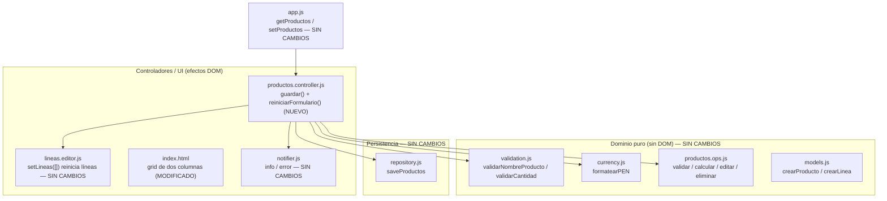

# Design Document

## Overview

Esta funcionalidad mejora la experiencia de uso de la Pagina_Productos de la Aplicacion Limpiapipas en dos aspectos independientes, sin alterar la lógica de cálculo, validación ni persistencia existentes:

1. **Reinicio del Formulario_De_Calculadora tras un Guardado_Exitoso** (Requisito 1): tras guardar un Producto correctamente, la Calculadora vuelve al Estado_Inicial_En_Blanco (nombre vacío, cero Lineas_De_Calculo en edición y Area_De_Resultado limpia). El reinicio ocurre tanto en el guardado normal como bajo Persistencia_Fallida (porque el Producto ya quedó creado en la sesión), y **nunca** ante un Guardado_Rechazado.
2. **Disposición responsiva de la Calculadora y la Lista_De_Productos** (Requisitos 2, 3, 4): en Modo_Escritorio ambos bloques se muestran lado a lado en dos columnas (Calculadora a la izquierda, Lista_De_Productos a la derecha) usando el sistema de rejilla de Bootstrap; en Modo_Movil se apilan verticalmente con la Calculadora arriba. La disposición degrada de forma segura cuando Bootstrap no se ha cargado.

El diseño se apoya estrictamente en la arquitectura existente: HTML, CSS y JavaScript vanilla puro, sin framework, sin empaquetado, con Bootstrap alojado localmente, ejecución bajo el Protocolo_De_Archivo (`file://`) y carga de la lógica mediante Scripts_Clasicos que publican sus APIs en el espacio de nombres global `window.LP`. La interfaz está en español y la moneda es soles (PEN).

El principio rector es **cambio mínimo y localizado**. Las dos mejoras son ortogonales entre sí y respecto del resto de la Aplicacion:

- El **Requisito 1** se resuelve con una única función privada nueva, `reiniciarFormulario()`, añadida a `crearProductosController` en `src/productos.controller.js`, invocada al final de `guardar()` tras `renderListaProductos()`. No cambia la lógica de validación, cálculo ni persistencia: `guardar()` ya retorna temprano ante un Guardado_Rechazado, por lo que el reinicio, ubicado al final, se ejecuta exactamente en los casos de Guardado_Exitoso (incluida la Persistencia_Fallida).
- Los **Requisitos 2, 3 y 4** se resuelven con un cambio **solo de estructura HTML + clases de Bootstrap** en `index.html`, envolviendo la Calculadora y la Lista_De_Productos en una fila (`div.row`) con dos columnas. **No** cambia la lógica JS de la Calculadora ni de la Lista: los ids (`#calculadora`, `#lista-productos`, `#producto-nombre`, `#resultado-calculo`, `#lineas-container`, etc.) se conservan intactos.

## Architecture

### Capas y ubicación de los cambios

La Aplicacion mantiene su separación entre lógica pura (sin DOM) y controladores (efectos DOM, cableado defensivo que degrada si el DOM está ausente). Este diseño solo toca la capa de UI (un controlador y el HTML de la vista) y no introduce módulos nuevos.



### Módulos afectados

| Archivo | Tipo | Responsabilidad del cambio |
| --- | --- | --- |
| `src/productos.controller.js` | **MODIFICADO** | Añadir la función privada `reiniciarFormulario()` dentro de `crearProductosController` e invocarla al final de `guardar()`, tras `renderListaProductos()`. Sin otros cambios de lógica. |
| `index.html` | **MODIFICADO** | Envolver `#calculadora` y el bloque de Lista_De_Productos (`<h2>Productos guardados</h2>` + `#lista-productos`) en un `div.row` con dos columnas de Bootstrap. Solo estructura y clases. |
| `styles/app.css` | **SIN CAMBIOS (o ajuste mínimo)** | El comportamiento apilado nativo (sin Bootstrap) ya lo aportan los `<div>` block por defecto; no se requiere CSS propio. Ver "Decisión de diseño: degradación segura". |
| `src/lineas.editor.js`, `productos.ops.js`, `repository.js`, `notifier.js`, `app.js` | **SIN CAMBIOS** | Se reutilizan tal cual. `editorLineas.setLineas([])` ya deja cero líneas y re-renderiza el estado vacío. |

### Decisión de diseño: ubicación del reinicio dentro de `guardar()`

La función `guardar()` actual tiene esta secuencia:

1. Validaciones que **retornan temprano** ante un Guardado_Rechazado (nombre inválido, sin líneas, cantidad/parámetro inválido, o Ciclo_De_Composicion) mostrando el mensaje de error correspondiente.
2. Cálculo de subtotales/total y construcción del Producto con `crearProducto`.
3. `productos.push(producto)` y `saveProductos(productos)`.
4. `setProductos(productos)` (siempre, para conservar en la sesión aunque la escritura falle).
5. Notificación: éxito normal o "no persistente" según el resultado de la escritura.
6. `renderListaProductos()`.

- **Decisión**: invocar `reiniciarFormulario()` como **última** instrucción de `guardar()`, después de `renderListaProductos()`.
- **Rationale**: como todas las ramas de Guardado_Rechazado retornan **antes** del punto 2, cualquier ejecución que alcance el final de `guardar()` es, por definición, un Guardado_Exitoso. Esto cubre de forma natural tanto el éxito normal como la Persistencia_Fallida (que no retorna temprano: solo cambia el mensaje), satisfaciendo los Requisitos 1.1–1.4 y 1.6 sin duplicar condiciones. Ubicar el reinicio tras `renderListaProductos()` garantiza que el Producto guardado ya esté en la Lista_De_Productos antes de vaciar el formulario (Requisito 1.6).
- **Consecuencia para el Requisito 1.5**: no se requiere ninguna guarda adicional; el reinicio simplemente nunca se alcanza en un Guardado_Rechazado.

### Decisión de diseño: estructura de rejilla responsiva

- **Decisión**: envolver ambos bloques en un contenedor de fila de Bootstrap (`div.row`) con dos columnas. La primera columna (Calculadora) y la segunda (Lista_De_Productos) usan `col-12` en móvil (xs/sm) y `col-lg-6` en escritorio.
- **Punto_De_Corte_Responsivo**: se elige el breakpoint **`lg`** de Bootstrap (≈992 px). Por debajo de `lg`, ambas columnas ocupan el 100% (`col-12`) y se apilan en el orden del DOM (Calculadora primero); a partir de `lg`, cada columna ocupa la mitad (`col-lg-6`) y se muestran lado a lado. El prefijo `lg` es lo que define el Punto_De_Corte_Responsivo (Requisitos 2.1, 3.1, 3.3, 3.4).
- **Rationale**: `lg` da a la Calculadora (con sus filas de líneas: fuente, selector, cantidad, unidad, botón) ancho suficiente antes de pasar a dos columnas, evitando que las columnas queden demasiado estrechas en tablets. `col-12` + `col-lg-6` es la expresión idiomática de Bootstrap para "apilado en móvil, dos columnas en escritorio" y garantiza que las columnas sumen 12 en el breakpoint (sin desplazamiento horizontal, Requisito 2.3).
- **Orden en el DOM**: la Calculadora se coloca **primero** en el marcado y la Lista_De_Productos **después**. En Modo_Escritorio esto la sitúa en la columna izquierda (Requisito 2.2); en Modo_Movil, arriba (Requisito 3.2).

### Decisión de diseño: degradación segura sin Bootstrap

- **Decisión**: no añadir CSS propio de layout; confiar en el comportamiento nativo del navegador.
- **Rationale**: sin las reglas de rejilla de Bootstrap (p. ej. si el CSS de Bootstrap no cargó bajo `file://`), los elementos `<div>` de columna son `display: block` por defecto, por lo que se apilan verticalmente ocupando el 100% del ancho de su contenedor, en el orden del DOM (Calculadora primero, Lista después). Este es exactamente el resultado exigido por el Requisito 4.1, y no requiere ninguna regla propia en `styles/app.css`. Todos los elementos quedan visibles y utilizables (Requisito 4.2), y como la lógica JS no depende del CSS de Bootstrap (solo de los ids, que se conservan), los controles interactivos siguen operando con el mismo resultado funcional (Requisito 4.3).
- **Ajuste en `styles/app.css`**: ninguno necesario. Si en pruebas visuales se detectara falta de separación vertical entre los bloques apilados sin Bootstrap, se podría añadir un margen inferior mínimo a la columna de la Calculadora; se documenta como opcional y no imprescindible para cumplir los criterios.

## Components and Interfaces

### 1. `reiniciarFormulario()` (privada, en `crearProductosController` — NUEVO)

Función privada nueva, del mismo estilo que las demás del controlador (accesos al DOM vía el helper `$(id)` y guardas contra `null` para degradar de forma segura bajo `file://`). Lleva el Formulario_De_Calculadora al Estado_Inicial_En_Blanco.

```js
/**
 * Reinicia el Formulario_De_Calculadora al Estado_Inicial_En_Blanco tras un
 * Guardado_Exitoso (Req 1.1, 1.2, 1.3):
 *   (a) fija el campo de nombre (#producto-nombre) en cadena vacía;
 *   (b) elimina todas las Lineas_De_Calculo en edición vía
 *       editorLineas.setLineas([]) (deja cero líneas y muestra la indicación
 *       de estado vacío "No hay líneas agregadas.");
 *   (c) limpia el Area_De_Resultado (#resultado-calculo) poniendo su
 *       textContent en "".
 * Cada acceso al DOM se guarda contra null (degradación segura, file://).
 */
function reiniciarFormulario() {
  const inputNombre = /** @type {HTMLInputElement|null} */ ($(IDS.nombre));
  if (inputNombre) inputNombre.value = "";

  if (editorLineas) editorLineas.setLineas([]);

  const resultado = $(IDS.resultado);
  if (resultado) resultado.textContent = "";
}
```

- **`(a)` Nombre**: se fija `input.value = ""` (Requisito 1.1). Se guarda contra `null` por si el input no existe.
- **`(b)` Líneas**: se reutiliza `editorLineas.setLineas([])`, que ya hace un deep-copy normalizado de la lista recibida y re-renderiza; con `[]` deja el estado interno en cero líneas y muestra la indicación de estado vacío del editor ("No hay líneas agregadas."), satisfaciendo el Requisito 1.2 sin lógica nueva. Se aprovecha exactamente el mismo mecanismo que ya usa la Ventana_Edicion para precargar/reiniciar líneas.
- **`(c)` Resultado**: se pone `#resultado-calculo` en `textContent = ""`, dejando el Area_De_Resultado sin subtotales ni Precio_Total (Requisito 1.3), de forma coherente con cómo `renderResultado()` lo limpia antes de re-renderizar.

### 2. Integración en `guardar()` (`productos.controller.js` — MODIFICADO)

Único cambio en `guardar()`: una llamada al final, tras `renderListaProductos()`.

```js
function guardar() {
  // ... validaciones que retornan temprano ante Guardado_Rechazado ...
  // ... cálculo, crearProducto, push, saveProductos, setProductos, notificación ...

  renderListaProductos();

  // NUEVO: reiniciar el formulario tras un Guardado_Exitoso (Req 1.1–1.4, 1.6).
  // Se alcanza solo si no hubo retorno temprano por Guardado_Rechazado (Req 1.5).
  reiniciarFormulario();
}
```

No se modifica ninguna otra parte de `guardar()`, ni las validaciones, ni el flujo de persistencia, ni los mensajes.

### 3. Estructura de rejilla en `index.html` (MODIFICADO)

Se reemplaza la disposición apilada actual dentro de `#pagina-productos` por una fila con dos columnas. El contenido interno de cada bloque (la card `#calculadora` y `#lista-productos`) **no cambia**; solo se envuelve.

```html
<section id="pagina-productos" class="lp-vista" aria-labelledby="titulo-productos">
  <h1 id="titulo-productos" class="h3">Productos</h1>

  <div class="row">
    <!-- Columna izquierda (escritorio) / arriba (móvil): Calculadora -->
    <div class="col-12 col-lg-6">
      <div id="calculadora" class="card mb-4">
        <!-- ... contenido de la Calculadora SIN CAMBIOS ... -->
      </div>
    </div>

    <!-- Columna derecha (escritorio) / abajo (móvil): Lista_De_Productos -->
    <div class="col-12 col-lg-6">
      <h2 class="h5">Productos guardados</h2>
      <div id="lista-productos"></div>
    </div>
  </div>
</section>
```

- La Calculadora aparece **primero** en el DOM → izquierda en escritorio (Req 2.2), arriba en móvil (Req 3.2), y arriba también sin Bootstrap (Req 4.1).
- `col-12` (móvil, apilado al 100%) + `col-lg-6` (escritorio, dos columnas) definen el Punto_De_Corte_Responsivo en `lg` (Req 2.1, 2.4, 3.1).
- Sin cambios en ids ni en el marcado interno de la Calculadora ni de la Lista, por lo que el cableado de `productos.controller.js` sigue idéntico (Req 4.3).

## Data Models

Esta funcionalidad **no introduce ni modifica ningún modelo de datos**. Se reutilizan sin cambios las entidades existentes de `models.js`:

```
Producto      = { id, nombre, lineas: LineaDeCalculo[], precioTotal, unidad }
LineaDeCalculo = { parametroId, cantidad, subtotal, fuenteDeComponente, productoComponenteId }
Parametro     = { id, nombre, precioUnitario, unidad }
```

El único "estado" relevante para el Requisito 1 es el **estado transitorio del Formulario_De_Calculadora**, que no es una entidad persistida:

- **Estado_Inicial_En_Blanco**: `#producto-nombre.value === ""`, `editorLineas.getLineas().length === 0` (con la indicación "No hay líneas agregadas." visible) y `#resultado-calculo.textContent === ""`.

El reinicio actúa exclusivamente sobre este estado de UI; la lista de Productos persistida ya fue actualizada por `guardar()` antes del reinicio.

## Correctness Properties

*A property is a characteristic or behavior that should hold true across all valid executions of a system-essentially, a formal statement about what the system should do. Properties serve as the bridge between human-readable specifications and machine-verifiable correctness guarantees.*

Estas propiedades se derivan del prework de los criterios de aceptación y se concentran en el **Requisito 1** (reinicio del formulario), que es un comportamiento determinista del controlador sobre el DOM con un espacio de entrada amplio (nombres y conjuntos de líneas válidos e inválidos), verificable con property-based testing sobre jsdom.

Los **Requisitos 2, 3 y 4** (disposición responsiva) **no** se expresan como propiedades universales: son comportamiento del sistema de rejilla de Bootstrap (media queries de CSS) y del reflow nativo del navegador, cuya verificación requiere un motor de layout real y no varía de forma interesante con "entradas". Se cubren con pruebas de estructura del DOM (por ejemplo) y verificación visual/manual (ver Testing Strategy).

Tras la reflexión de propiedades, los criterios 1.1, 1.2 y 1.3 (y el reinicio bajo Persistencia_Fallida de 1.4) se consolidan en una única propiedad de "Estado_Inicial_En_Blanco tras Guardado_Exitoso", parametrizada sobre el resultado de la persistencia. El criterio 1.5 (no reinicio ante rechazo) es la propiedad complementaria, y el 1.6 (inclusión en la lista antes del reinicio) es una propiedad de resultado distinta.

### Property 1: Un Guardado_Exitoso deja el formulario en el Estado_Inicial_En_Blanco

*For any* nombre de Producto válido y cualquier conjunto de Lineas_De_Calculo válidas (con o sin Persistencia_Fallida en la escritura), tras invocar `guardar()` el Formulario_De_Calculadora queda en el Estado_Inicial_En_Blanco: el campo `#producto-nombre` es cadena vacía, `editorLineas.getLineas()` tiene longitud cero (con la indicación de estado vacío visible) y `#resultado-calculo` no contiene subtotales ni Precio_Total.

**Validates: Requirements 1.1, 1.2, 1.3, 1.4**

### Property 2: Un Guardado_Rechazado conserva el formulario sin cambios

*For any* estado del Formulario_De_Calculadora que produce un Guardado_Rechazado (nombre inválido, cero líneas, alguna cantidad o parámetro inválido, o Ciclo_De_Composicion), tras invocar `guardar()` el valor del campo de nombre, las Lineas_De_Calculo en edición y el contenido del Area_De_Resultado permanecen idénticos a su estado previo a la llamada.

**Validates: Requirements 1.5**

### Property 3: Un Guardado_Exitoso agrega el Producto a la lista antes de reiniciar

*For any* nombre válido y cualquier conjunto de líneas válidas, tras un Guardado_Exitoso la Lista_De_Productos contiene el Producto recién guardado (mismo nombre y Precio_Total calculado) **y** el Formulario_De_Calculadora queda en el Estado_Inicial_En_Blanco; es decir, la inclusión del Producto en la lista es observable junto con el formulario ya vacío.

**Validates: Requirements 1.6**

## Error Handling

El diseño mantiene la política de la Aplicacion base: la lógica pura no cambia y el controlador degrada de forma segura ante la ausencia de elementos del DOM.

- **Guardado_Rechazado (Req 1.5)**: sin cambios. `guardar()` retorna temprano tras `notifier.error(...)` con el mensaje exacto correspondiente (nombre inválido, `SIN_LINEAS`, `CANTIDAD_INVALIDA`, `SIN_PARAMETRO`, o mensaje de ciclo), por lo que `reiniciarFormulario()` no se ejecuta y los datos ingresados se conservan intactos.
- **Persistencia_Fallida (Req 1.4)**: `saveProductos` devuelve `{status:"failed"}` cuando el Almacenamiento_Local no está disponible o se supera la cuota. `guardar()` ya aplica `setProductos(productos)` de todos modos (el Producto queda en la sesión) y muestra el mensaje de "no persistente". Como esta rama **no** retorna temprano, el flujo alcanza `reiniciarFormulario()` y el formulario se reinicia igualmente, en línea con el Requisito 1.4 (el Producto ya está creado en la sesión).
- **Degradación segura del reinicio**: cada acceso al DOM en `reiniciarFormulario()` se guarda contra `null` (patrón `$()` ya usado). Si `#producto-nombre` o `#resultado-calculo` no existen, o si `editorLineas` aún no se instanció, el reinicio no lanza; simplemente omite el paso ausente.
- **Degradación segura del layout (Req 4)**: sin el CSS de rejilla de Bootstrap, los `<div>` de columna se apilan al 100% en el orden del DOM (Calculadora arriba), quedando todo visible y utilizable. Como los ids se conservan, el cableado JS y la funcionalidad de la Calculadora y la Lista no dependen del CSS y siguen operando (Req 4.3). El aviso existente `#aviso-estilos` (Req 7.4 de la base) sigue informando cuando Bootstrap no cargó.
- **Sin nuevos modos de error**: no se añaden entradas, validaciones ni rutas de persistencia; por tanto no hay nuevos errores que manejar más allá de las guardas de DOM.

## Testing Strategy

Se mantiene el enfoque dual de la Aplicacion base y sus convenciones: los Scripts_Clasicos se cargan con el helper `tests/helpers/cargarLP.js` sobre el `window` de jsdom, y las pruebas se ejecutan con **Vitest** en una sola pasada (`--run`, sin modo watch).

### Property-Based Testing

PBT **aplica al Requisito 1** (reinicio del formulario), un comportamiento determinista del controlador sobre el DOM con un espacio de entrada amplio (nombres válidos/invalidos y conjuntos de líneas válidos/invalidos), verificable en jsdom sin depender de CSS.

PBT **no aplica a los Requisitos 2, 3 y 4** (disposición responsiva): son comportamiento del sistema de rejilla de Bootstrap (media queries de CSS) y del reflow nativo del navegador; jsdom no aplica layout de CSS y no hay una propiedad universal "para toda entrada X, P(X)" que capture el reflow. Se cubren con pruebas de estructura del DOM y verificación visual/manual.

- **Biblioteca**: **fast-check** (ya usada en el proyecto, p. ej. `tests/lineas.editor.test.js`). No se implementa PBT desde cero.
- **Iteraciones**: mínimo **100** por propiedad (`fc.assert(fc.property(...), { numRuns: 100 })`).
- **Entorno**: jsdom (entorno de Vitest). Se monta un DOM mínimo con `#producto-nombre`, `#lineas-container`, `#btn-agregar-linea`, `#btn-calcular`, `#resultado-calculo`, `#btn-guardar-producto` y `#lista-productos`, se instancia el controlador con accesores `getParametros`/`getProductos`/`setProductos` en memoria y un `repository` simulable.
- **Generadores**: `arbNombreValido` (1–100 caracteres no vacíos tras recortar); `arbLineaValida` (parametroId de un conjunto de Parametros generados + cantidad válida 0,01–999.999.999,99 con ≤2 decimales); `arbEntradaInvalida` (nombre vacío/solo espacios, cero líneas, cantidad fuera de rango, o parámetro inexistente) para la Property 2. Se cubren casos límite (nombre en los bordes de longitud, una vs. varias líneas, cantidades en los extremos del rango).
- **Persistencia simulada**: para la Property 1 se ejercita en dos modos —escritura exitosa y `repository` que devuelve `{status:"failed"}` (Persistencia_Fallida)— comprobando que el reinicio ocurre en ambos.
- **Etiquetado**: cada test de propiedad se anota con un comentario **Feature: product-form-reset-and-responsive-layout, Property {número}: {texto de la propiedad}** y se implementa con **un único** test de propiedad por propiedad de diseño.

Correspondencia propiedad → test (3 propiedades, 3 tests de propiedad):

| Propiedad | Bajo prueba | Requisitos |
| --- | --- | --- |
| 1 | `guardar()` → Estado_Inicial_En_Blanco (éxito y Persistencia_Fallida) | 1.1, 1.2, 1.3, 1.4 |
| 2 | `guardar()` con entradas inválidas → formulario sin cambios | 1.5 |
| 3 | `guardar()` → Producto en la lista + formulario en blanco | 1.6 |

### Unit tests (por ejemplo y casos límite)

Complementan las propiedades con escenarios concretos y mensajes exactos; se evita duplicar la cobertura de las propiedades.

- **Persistencia_Fallida (Req 1.4)**: con un `repository` que devuelve `failed`, tras `guardar()` se muestra el mensaje exacto de "no persistente" **y** el formulario queda en el Estado_Inicial_En_Blanco (el mensaje se verifica por ejemplo; el reinicio ya lo cubre la Property 1).
- **Estado vacío del editor (Req 1.2)**: tras el reinicio, `#lineas-container` contiene la indicación `.lp-lineas-vacias` con el texto "No hay líneas agregadas.".
- **Degradación del reinicio**: invocar `guardar()` con el DOM incompleto (sin `#producto-nombre` o sin `#resultado-calculo`) no lanza.
- **Cada tipo de Guardado_Rechazado (Req 1.5)**: casos concretos (nombre vacío, cero líneas, cantidad inválida, parámetro inexistente) que verifican el mensaje exacto y que no se reinicia.

### DOM structure tests (jsdom, por ejemplo) — Layout responsivo

Como el reflow real no es observable en jsdom, se verifica la **estructura** que Bootstrap necesita para producirlo, cargando el `index.html` en jsdom:

- Existe un `div.row` dentro de `#pagina-productos` con exactamente dos columnas (Req 2.4).
- La primera columna contiene `#calculadora` y la segunda contiene `#lista-productos`; es decir, la Calculadora precede a la Lista en el orden del DOM (Req 2.2, 3.2, 4.1).
- Ambas columnas llevan `col-12` (apilado en móvil, Req 3.1) y `col-lg-6` (dos columnas en escritorio con el Punto_De_Corte_Responsivo en `lg`; suman 12, sin desplazamiento horizontal, Req 2.1, 2.3).
- Los ids `#calculadora`, `#lista-productos`, `#producto-nombre`, `#resultado-calculo`, `#lineas-container` se conservan, de modo que las suites de controlador existentes siguen verdes (Req 4.3).

### Verificación visual / manual — Layout responsivo

Los criterios que dependen del motor de CSS y del reflow al redimensionar (Req 2.3, 3.3, 3.4, 4.2) se validan de forma manual/visual, ya que no son verificables de forma fiable en jsdom:

- En escritorio (≥ `lg`), Calculadora y Lista se ven lado a lado sin desplazamiento horizontal.
- Al reducir el ancho por debajo de `lg`, los bloques se apilan (Calculadora arriba); al aumentarlo, vuelven a dos columnas.
- Con el CSS de Bootstrap deshabilitado (simulando la no carga bajo `file://`), ambos bloques se apilan al 100% en orden del DOM, visibles y utilizables.

### Regresión

Las suites existentes (`tests/lista.productos.test.js`, `tests/ventana.edicion.test.js`, `tests/calculadora.regression.test.js`, etc.) deben permanecer verdes: el cambio de `guardar()` solo añade el reinicio al final y el cambio de `index.html` solo reordena/envuelve marcado sin tocar ids ni lógica.
