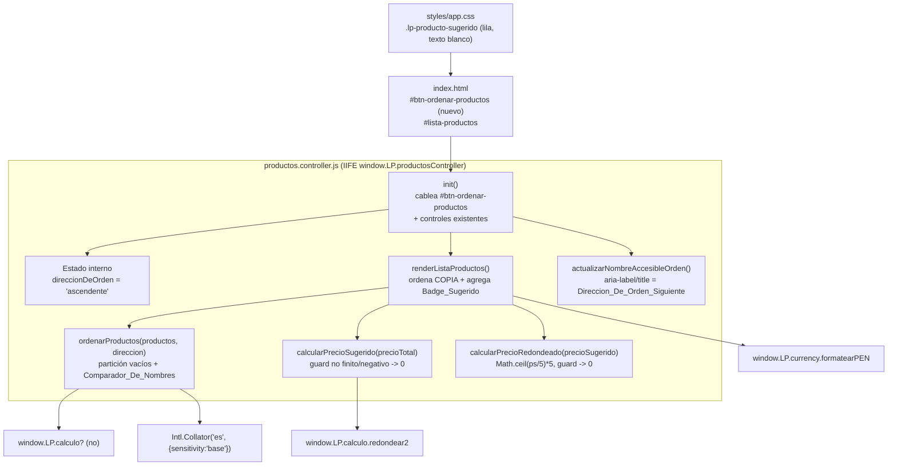

# Documento de Diseño

## Overview

Esta funcionalidad amplía la `renderListaProductos()` del `Controlador_De_Productos`
(`src/productos.controller.js`) con dos capacidades independientes definidas en los
Requisitos 1 y 2:

1. **Ordenamiento por nombre (Req 1):** un `Boton_De_Orden` estático en `index.html`
   que, al pulsarse, alterna la `Direccion_De_Orden` entre `ascendente` y `descendente`
   y re-renderiza la `Lista_De_Productos` ordenada por `Nombre_Mostrado` mediante un
   `Comparador_De_Nombres` basado en `Intl.Collator('es', { sensitivity: 'base' })`.
   El ordenamiento se aplica sobre una **copia** de la lista de Productos (no muta el
   arreglo devuelto por `getProductos()`), es estable y coloca los Productos con
   nombre vacío al inicio (ascendente) o al final (descendente).

2. **Precio sugerido (Req 2):** junto al badge verde del `Precio_Total` existente, se
   renderiza un `Badge_Sugerido` lila con texto blanco que muestra dos montos
   formateados en PEN separados por el literal ` -> `: a la izquierda el
   `Precio_Sugerido`, calculado como `redondear2(precioTotal / 0.70)`, y a la derecha el
   `Precio_Redondeado`, el menor múltiplo de 5 mayor o igual al `Precio_Sugerido`
   (`Math.ceil(Precio_Sugerido / 5) * 5`). Ejemplo: `"S/ 14.30 -> S/ 15.00"`. Se protege
   contra `Precio_Total` no finito o negativo tratándolo como `0` (badge `"S/ 0.00 -> S/ 0.00"`).

Ambas capacidades reutilizan la infraestructura existente sin sintaxis de Módulos ES:
el IIFE publicado en `window.LP.productosController`, el formateo de moneda
`window.LP.currency.formatearPEN` y el redondeo half-up `window.LP.calculo.redondear2`.
El `Precio_Redondeado` se calcula con `Math.ceil`, parte de la plataforma. No se
introducen nuevas dependencias externas: `Intl.Collator` es parte de la plataforma.

### Restricciones del entorno (confirmadas en el código)

- **Scripts clásicos bajo `file://`:** cada módulo de `src/` es un IIFE
  `(function (global) { ... })(window)`; no hay `import`/`export`. El nuevo código vive
  dentro del IIFE existente de `productos.controller.js`.
- **Acceso al DOM defensivo:** todo acceso al DOM debe guardarse contra `null`
  (degradación segura) siguiendo el patrón `const $ = (id) => document.getElementById(id)`
  ya presente en el controlador.
- **`formatearPEN` con entrada no finita:** para entradas no finitas produciría
  `"S/ NaN"` (usa `Math.round(n * 100)` internamente). Por eso el diseño **debe** proteger
  el `Precio_Total` no finito/negativo antes de calcular y formatear el `Precio_Sugerido`
  (Req 2.12).
- **`redondear2` con entrada no finita:** devuelve `NaN` (`Number.isFinite` guard). El
  cálculo del sugerido protege la entrada antes de dividir.

## Architecture

El diseño mantiene la arquitectura por capas existente. Todos los cambios se concentran
en la capa de presentación (controlador + HTML + CSS); la lógica pura reutilizada
(`currency`, `calculo`) no se modifica.



### Flujo de ordenamiento

1. En `init()`, la `Direccion_De_Orden` se inicializa en `'ascendente'` (Req 1.2) y se
   cablea el `click` del `Boton_De_Orden`.
2. Al pulsar el botón, el manejador alterna la `Direccion_De_Orden` (Req 1.3, 1.4),
   actualiza el `Nombre_Accesible` del botón para reflejar la
   `Direccion_De_Orden_Siguiente` (Req 1.14) y llama a `renderListaProductos()`.
3. `renderListaProductos()` obtiene `getProductos()`, crea una **copia** con `.slice()`,
   la ordena con `ordenarProductos(copia, direccionDeOrden)` y renderiza a partir de la
   copia ordenada. El arreglo original nunca se muta (evita alterar el orden de guardado
   subyacente).

### Flujo de precio sugerido

Dentro del bucle de render de cada `<li>`, tras crear el badge verde del `Precio_Total`
existente (sin cambios), se calcula `calcularPrecioSugerido(producto.precioTotal)` y, a
partir de él, `calcularPrecioRedondeado(...)`. Se inserta un
`span.badge.rounded-pill.lp-producto-sugerido` a la derecha del badge verde, dentro del
mismo bloque de información, cuyo texto compone ambos montos formateados en PEN separados
por el literal ` -> ` (a la izquierda el `Precio_Sugerido`, a la derecha el
`Precio_Redondeado`), p. ej. `"S/ 14.30 -> S/ 15.00"`.

### Decisiones de diseño

- **Botón estático en `index.html` (recomendado):** se añade un `<button>` con id estable
  `#btn-ordenar-productos` junto al encabezado "Productos guardados", cableado en `init()`.
  Esto es coherente con la convención de cableado por id del controlador (`IDS.*` +
  `$(id)` + `addEventListener`) y con la del resto de controles. La alternativa (renderizar
  el botón dinámicamente desde `renderListaProductos`) obligaría a re-cablear el listener
  en cada render y a gestionar el foco tras cada re-render; se descarta por complejidad.
- **Ordenar una copia:** `getProductos()` devuelve el arreglo compartido en memoria; se
  ordena `getProductos().slice()` para no reordenar el estado subyacente ni afectar el
  orden de persistencia. Consecuencia para pruebas: ver "Testing Strategy".
- **Color lila del `Badge_Sugerido`:** se introduce una clase propia
  `.lp-producto-sugerido` en `styles/app.css` (no existe clase lila en Bootstrap). Se
  propone el morado de Bootstrap `#6f42c1` como fondo con texto blanco, reutilizando las
  utilidades `badge rounded-pill` para la forma de píldora (Req 2.9). El valor exacto es
  una decisión de diseño ajustable. **El CSS no cambia con este cambio de funcionalidad:**
  el nuevo formato del texto (dos montos separados por ` -> `) solo afecta al
  `textContent` del span; la clase y los colores (fondo lila, texto blanco vía
  `.lp-producto-sugerido`) permanecen idénticos.
- **Cálculo del `Precio_Redondeado` y punto flotante:** el `Precio_Redondeado` es el menor
  múltiplo de 5 mayor o igual al `Precio_Sugerido` (`Math.ceil(ps / 5) * 5`), inclusivo:
  si el `Precio_Sugerido` ya es múltiplo de 5 (p. ej. `15.00`), el `Precio_Redondeado` es
  ese mismo valor (`15.00`), no `20.00` (Req 2.3, 2.4). Como `precioSugerido` proviene de
  `redondear2` (2 decimales), la división `ps / 5` puede arrastrar error de punto flotante
  (p. ej. `15 / 5` podría representarse como `3.0000000001`), lo que empujaría
  `Math.ceil` a `4` y el resultado a `20`. Para evitarlo, `calcularPrecioRedondeado`
  redondea el cociente antes de aplicar `Math.ceil` (p. ej. `Math.ceil(redondear2(ps / 5))`,
  equivalente a usar una pequeña épsilon), de modo que un múltiplo exacto como `15.00` no
  se desplace a `20`.
- **Partición de nombres vacíos:** el `Comparador_De_Nombres` (collator) por sí solo
  ordenaría la cadena vacía siempre antes que cualquier otra cadena. Para cumplir Req 1.10
  y 1.11 (vacíos al inicio en ascendente, al final en descendente) se aplica una
  **partición previa**: se separan los Productos con nombre normalizado vacío de los no
  vacíos; los no vacíos se ordenan con el collator (invirtiendo el resultado para
  descendente), y los vacíos se anteponen (ascendente) o se anexan (descendente),
  conservando su orden relativo original (estabilidad, Req 1.12).

## Components and Interfaces

Todos los componentes nuevos viven dentro del IIFE de `src/productos.controller.js`. No
se crean archivos nuevos de `src/`.

### 1. Estado de ordenamiento (dentro de `crearProductosController`)

```js
// Estado de la Direccion_De_Orden de la Lista_De_Productos (Req 1.2).
// Valores válidos: 'ascendente' | 'descendente'. Inicial: 'ascendente'.
let direccionDeOrden = "ascendente";
```

Se declara junto a los demás estados internos del controlador (p. ej. `editorLineas`,
`edicionId`). Es privado del controlador; no se expone en la API pública.

### 2. `IDS.btnOrdenar`

Se añade a la constante `IDS` del módulo:

```js
const IDS = {
  // ... ids existentes ...
  btnOrdenar: "btn-ordenar-productos",
};
```

### 3. `Comparador_De_Nombres` — collator en español

```js
// Comparador_De_Nombres: locale 'es', sensibilidad base (ignora
// mayúsculas/minúsculas y diacríticos), ordena ñ y acentos según el alfabeto
// español (Req 1.7, 1.8). Se crea una sola vez a nivel de módulo.
const colacionNombres = new Intl.Collator("es", { sensitivity: "base" });

/**
 * Normaliza el Nombre_Mostrado a efectos de comparación: null/undefined -> ""
 * (Req 1.9). No recorta espacios (la especificación define "vacío" respecto al
 * valor del nombre; el tratamiento de null/ausente es explícito).
 * @param {string|null|undefined} nombre
 * @returns {string}
 */
function normalizarNombre(nombre) {
  return nombre == null ? "" : String(nombre);
}
```

`Intl.Collator('es', { sensitivity: 'base' })`:
- `sensitivity: 'base'` trata como equivalentes las variantes de mayúsculas/minúsculas y
  de diacríticos (`a` == `A` == `á`), cumpliendo Req 1.7.
- El locale `es` posiciona `ñ` y las vocales acentuadas según el alfabeto español (Req 1.8).
- `.compare(a, b)` devuelve `< 0`, `0` o `> 0`; `0` para nombres equivalentes, que se
  aprovecha para preservar el orden previo (estabilidad).

### 4. `ordenarProductos(productos, direccion)`

```js
/**
 * Devuelve una NUEVA lista de Productos ordenada por Nombre_Mostrado según la
 * Direccion_De_Orden, sin mutar la lista de entrada (Req 1.5, 1.6).
 *
 * Reglas:
 *  - Los Productos con Nombre_Mostrado normalizado igual a "" van al inicio en
 *    ascendente (Req 1.10) y al final en descendente (Req 1.11), conservando su
 *    orden relativo original (estabilidad, Req 1.12).
 *  - Los no vacíos se ordenan con el Comparador_De_Nombres; en descendente se
 *    invierte el sentido. Los empates (compare === 0) conservan el orden previo
 *    gracias a que Array.prototype.sort es estable y a la desempate por índice.
 *
 * @param {Array<{nombre?: string|null}>} productos
 * @param {"ascendente"|"descendente"} direccion
 * @returns {Array} nueva lista ordenada (copia)
 */
function ordenarProductos(productos, direccion) {
  const lista = (productos || []).slice(); // copia defensiva (no mutar entrada)
  const esDescendente = direccion === "descendente";

  // Partición conservando el orden original dentro de cada grupo (Req 1.12).
  const vacios = [];
  const noVacios = [];
  lista.forEach((producto, indice) => {
    const nombre = normalizarNombre(producto && producto.nombre);
    if (nombre === "") vacios.push({ producto, indice });
    else noVacios.push({ producto, indice });
  });

  noVacios.sort((a, b) => {
    const cmp = colacionNombres.compare(
      normalizarNombre(a.producto.nombre),
      normalizarNombre(b.producto.nombre)
    );
    if (cmp !== 0) return esDescendente ? -cmp : cmp;
    // Empate: preservar el orden previo (estabilidad, Req 1.12).
    return a.indice - b.indice;
  });

  const ordenados = noVacios.map((e) => e.producto);
  const vaciosProductos = vacios.map((e) => e.producto);

  // Vacíos al inicio (ascendente) o al final (descendente) (Req 1.10, 1.11).
  return esDescendente
    ? ordenados.concat(vaciosProductos)
    : vaciosProductos.concat(ordenados);
}
```

Nota: la desempate por `indice` hace la ordenación estable de forma independiente de la
implementación de `Array.prototype.sort`, cubriendo Req 1.12.

### 5. `calcularPrecioSugerido(precioTotal)`

```js
// Divisor_De_Sugerido: constante (Req 2.2).
const DIVISOR_DE_SUGERIDO = 0.7;

/**
 * Calcula el Precio_Sugerido como redondear2(precioTotal / 0.70) (Req 2.2).
 * Protege la entrada: si precioTotal no es finito o es negativo, se trata como 0
 * (Req 2.11, 2.12), de modo que el resultado sea 0 y formatearPEN no produzca
 * "S/ NaN". Devuelve un número finito listo para formatearPEN.
 *
 * @param {number} precioTotal
 * @returns {number} Precio_Sugerido finito (>= 0)
 */
function calcularPrecioSugerido(precioTotal) {
  const base = Number.isFinite(precioTotal) && precioTotal >= 0 ? precioTotal : 0;
  const sugerido = redondear2(base / DIVISOR_DE_SUGERIDO);
  return Number.isFinite(sugerido) ? sugerido : 0;
}
```

`redondear2` es el alias existente a `window.LP.calculo.redondear2` (ya declarado en el
módulo). Para `base = 0`, `redondear2(0)` es `0` y `formatearPEN(0)` es `"S/ 0.00"`
(Req 2.11).

### 5b. `calcularPrecioRedondeado(precioSugerido)`

```js
// Multiplo_De_Redondeo: constante (Req 2.3).
const MULTIPLO_DE_REDONDEO = 5;

/**
 * Calcula el Precio_Redondeado como el menor múltiplo de 5 mayor o IGUAL al
 * Precio_Sugerido: Math.ceil(precioSugerido / 5) * 5 (Req 2.3). Es inclusivo: si
 * precioSugerido ya es múltiplo de 5, el resultado es ese mismo valor (Req 2.4).
 *
 * Punto flotante: precioSugerido proviene de redondear2 (2 decimales); la división
 * ps / 5 puede introducir un error mínimo (p. ej. 15 / 5 -> 3.0000000001) que
 * empujaría Math.ceil al siguiente entero (4 -> 20). Para robustez, se redondea el
 * cociente a 2 decimales antes de Math.ceil (equivalente a usar una épsilon), de
 * modo que un múltiplo exacto como 15.00 NO se desplace a 20.00.
 *
 * Protege la entrada: si precioSugerido no es finito o es negativo, devuelve 0
 * (0 es múltiplo de 5), evitando que formatearPEN produzca "S/ NaN" (Req 2.12).
 *
 * @param {number} precioSugerido
 * @returns {number} Precio_Redondeado finito (>= 0), múltiplo de 5
 */
function calcularPrecioRedondeado(precioSugerido) {
  if (!Number.isFinite(precioSugerido) || precioSugerido < 0) return 0;
  // redondear2 del cociente neutraliza el error de punto flotante antes de ceil.
  return Math.ceil(redondear2(precioSugerido / MULTIPLO_DE_REDONDEO)) * MULTIPLO_DE_REDONDEO;
}
```

Para `precioSugerido = 0`, `Math.ceil(0) * 5` es `0` y `formatearPEN(0)` es `"S/ 0.00"`
(Req 2.11). Para un múltiplo exacto como `15.00`, `redondear2(15 / 5)` es `3` y
`Math.ceil(3) * 5` es `15`, no `20` (Req 2.4).

### 6. `actualizarNombreAccesibleOrden()`

```js
/**
 * Fija el Nombre_Accesible del Boton_De_Orden para que describa la
 * Direccion_De_Orden_Siguiente (el valor opuesto al actual), en aria-label y
 * title (Req 1.14). Degrada de forma segura si el botón no existe.
 */
function actualizarNombreAccesibleOrden() {
  const boton = $(IDS.btnOrdenar);
  if (!boton) return;
  const siguiente =
    direccionDeOrden === "ascendente" ? "descendente" : "ascendente";
  const etiqueta = `Ordenar productos por nombre en orden ${siguiente}`;
  boton.setAttribute("aria-label", etiqueta);
  boton.setAttribute("title", etiqueta);
}
```

Con `Direccion_De_Orden` inicial `ascendente`, el `Nombre_Accesible` inicial describe la
`Direccion_De_Orden_Siguiente` = `descendente` (la que se aplicará al pulsar).

### 7. Cambios en `renderListaProductos()`

Dos modificaciones sobre la función existente:

**(a) Ordenar sobre una copia** — se reemplaza la obtención de `productos` por su versión
ordenada:

```js
const productosOriginales = getProductos() || [];
if (productosOriginales.length === 0) {
  // ... estado vacío existente (Req 1.13, sin cambios) ...
  return;
}
const productos = ordenarProductos(productosOriginales, direccionDeOrden);
productos.forEach((producto) => { /* ... render de <li> ... */ });
```

El estado vacío (Req 1.13) se evalúa antes de ordenar y conserva el marcado existente
(`p.text-muted.lp-productos-vacios` con "No hay productos guardados.").

**(b) Insertar el `Badge_Sugerido`** — dentro del bloque `info`, tras el badge verde
existente (que **no cambia**):

```js
const precioEl = document.createElement("span");
precioEl.className = "badge bg-success rounded-pill lp-producto-precio";
precioEl.textContent = formatearPEN(producto.precioTotal); // sin cambios (Req 2.10)

const sugeridoEl = document.createElement("span");
// La clase NO cambia: colores (fondo lila, texto blanco) definidos en styles/app.css.
sugeridoEl.className = "badge rounded-pill lp-producto-sugerido";
const precioSugerido = calcularPrecioSugerido(producto.precioTotal);
const precioRedondeado = calcularPrecioRedondeado(precioSugerido);
// Texto compuesto: Precio_Sugerido -> Precio_Redondeado, ambos en PEN (Req 2.5, 2.6, 2.7).
sugeridoEl.textContent =
  formatearPEN(precioSugerido) + " -> " + formatearPEN(precioRedondeado);

info.appendChild(nombreEl);
info.appendChild(precioEl);
info.appendChild(sugeridoEl); // a la derecha del badge verde (Req 2.1)
```

### 8. Cambios en `init()`

```js
function init() {
  // ... instanciación de editorLineas y cableado de btnCalcular/btnGuardar ...

  const btnOrdenar = $(IDS.btnOrdenar);
  if (btnOrdenar) {
    btnOrdenar.addEventListener("click", () => {
      direccionDeOrden =
        direccionDeOrden === "ascendente" ? "descendente" : "ascendente"; // Req 1.3, 1.4
      actualizarNombreAccesibleOrden(); // refleja la nueva Direccion_De_Orden_Siguiente (Req 1.14)
      renderListaProductos(); // re-render con el nuevo orden (Req 1.5, 1.6)
    });
  }
  actualizarNombreAccesibleOrden(); // Nombre_Accesible inicial (Req 1.14)

  render();
}
```

### 9. Cambios en `index.html`

Se añade el `Boton_De_Orden` estático junto al encabezado "Productos guardados", dentro de
`#pagina-productos`:

```html
<div class="col-12 col-lg-6">
  <div class="d-flex justify-content-between align-items-center">
    <h2 class="h5 mb-0">Productos guardados</h2>
    <button type="button" id="btn-ordenar-productos"
            class="btn btn-outline-secondary btn-sm">
      Ordenar por nombre
    </button>
  </div>
  <div id="lista-productos"></div>
</div>
```

El texto visible "Ordenar por nombre" identifica el control (Req 1.1); el
`Nombre_Accesible` dinámico (aria-label/title) describe la `Direccion_De_Orden_Siguiente`
(Req 1.14).

### 10. Cambios en `styles/app.css`

El CSS **no cambia** respecto al diseño previo del sugerido: el nuevo formato de texto
(dos montos separados por ` -> `) solo afecta al `textContent`, no a la clase ni al color.

```css
/* Badge_Sugerido: píldora lila con texto blanco, misma forma que el badge del
   Precio_Total pero con color lila (Req 2.8, 2.9). Bootstrap no incluye una
   clase lila, por lo que se define aquí. Valor de color: decisión de diseño. */
.lp-producto-sugerido {
  background-color: #6f42c1; /* morado/lila (Bootstrap purple) */
  color: #fff;
}
```

## Data Models

Esta funcionalidad no introduce entidades persistidas nuevas ni cambia el esquema del
`Producto`. Trabaja sobre estructuras ya existentes:

- **Producto** (sin cambios): `{ id: string, nombre: string, lineas: Array, precioTotal: number }`.
  Se leen `nombre` (para ordenar) y `precioTotal` (para el sugerido). No se escribe.
- **Direccion_De_Orden** (estado en memoria, no persistido): unión de cadenas
  `'ascendente' | 'descendente'`. Vive en el closure del controlador; se reinicia a
  `'ascendente'` cada vez que se crea el controlador (Req 1.2).
- **Divisor_De_Sugerido** (constante): `0.70`.
- **Precio_Sugerido** (valor derivado, no persistido): `number` finito `>= 0`, calculado
  por render a partir de `precioTotal` como `redondear2(precioTotal / 0.70)`.
- **Precio_Redondeado** (valor derivado, no persistido): `number` finito `>= 0` y
  múltiplo de 5, calculado por render a partir del `Precio_Sugerido` como el menor
  múltiplo de 5 mayor o igual a este (`Math.ceil(precioSugerido / 5) * 5`, inclusivo).

Ninguno de estos valores se guarda en `localStorage` ni altera el arreglo devuelto por
`getProductos()` (el ordenamiento opera sobre una copia).

## Correctness Properties

*Una propiedad es una característica o comportamiento que debe cumplirse en todas las
ejecuciones válidas de un sistema — esencialmente, una afirmación formal de lo que el
sistema debe hacer. Las propiedades son el puente entre las especificaciones legibles por
humanos y las garantías de corrección verificables por máquina.*

Estas propiedades se derivan del prework de criterios de aceptación. Se aplican a las
funciones puras `ordenarProductos`, `normalizarNombre` (vía el `Comparador_De_Nombres`) y
`calcularPrecioSugerido`, y a los invariantes de render observables en el DOM.

**Reflexión de propiedades (eliminación de redundancia):**
- Se factoriza una única propiedad de **permutación** (Propiedad 1) que cubre la parte
  común de Req 1.5 y 1.6 (la salida ordenada contiene exactamente los mismos elementos que
  la entrada en ambas direcciones), evitando repetirla en las propiedades de orden.
- Las propiedades de **orden ascendente** (Propiedad 2) y **descendente** (Propiedad 3) se
  mantienen separadas porque afirman relaciones opuestas sobre la porción no vacía.
- La **colocación de vacíos** (Propiedad 5) se unifica en una sola propiedad parametrizada
  por dirección (cubre Req 1.10 y 1.11), en lugar de dos propiedades casi idénticas.
- El **formato compuesto del Badge_Sugerido** (Propiedad 8) subsume la verificación de
  `formatearPEN` de ambos montos (Req 2.5, 2.6) y de su composición con ` -> ` (Req 2.7),
  incluyendo los casos límite de precio (0, no finito, negativo): al cumplirse para todo
  producto generado, cubre también las salidas de Req 2.11 y 2.12.
- El **cálculo del Precio_Redondeado** (Propiedad 11) unifica Req 2.3 (menor múltiplo de 5
  mayor o igual al `Precio_Sugerido`) y Req 2.4 (caso inclusivo: si el `Precio_Sugerido` ya
  es múltiplo de 5, el resultado es ese mismo valor), ya que la caracterización universal
  "múltiplo de 5, `>= ps` y `(resultado - 5) < ps`" implica el caso inclusivo.
- La **alternancia** del botón (Propiedad 9) expresa la combinación de Req 1.3 y 1.4 como
  una propiedad de paridad, en vez de duplicar ejemplos.

### Property 1: El ordenamiento es una permutación de la entrada

*Para toda* lista de Productos y *para toda* `Direccion_De_Orden`, la lista devuelta por
`ordenarProductos` contiene exactamente los mismos Productos que la entrada (misma
multiplicidad), sin agregar, eliminar ni duplicar elementos, y sin mutar la lista original.

**Validates: Requirements 1.5, 1.6**

### Property 2: Orden ascendente no decreciente

*Para toda* lista de Productos, en `Direccion_De_Orden` `ascendente` la porción de
Productos con `Nombre_Mostrado` no vacío queda ordenada de forma no decreciente según el
`Comparador_De_Nombres` (para todo par de posiciones consecutivas `i`, `i+1` de esa porción,
`colacionNombres.compare(nombre_i, nombre_{i+1}) <= 0`).

**Validates: Requirements 1.5**

### Property 3: Orden descendente no creciente

*Para toda* lista de Productos, en `Direccion_De_Orden` `descendente` la porción de
Productos con `Nombre_Mostrado` no vacío queda ordenada de forma no creciente según el
`Comparador_De_Nombres` (para todo par consecutivo `i`, `i+1` de esa porción,
`colacionNombres.compare(nombre_i, nombre_{i+1}) >= 0`).

**Validates: Requirements 1.6**

### Property 4: Insensibilidad a mayúsculas/minúsculas y diacríticos

*Para toda* cadena de nombre, el `Comparador_De_Nombres` la considera equivalente
(`compare === 0`) a su variante en mayúsculas y a su variante equivalente con/sin
diacríticos, según el locale `es` con sensibilidad base.

**Validates: Requirements 1.7**

### Property 5: Colocación de los nombres vacíos según la dirección

*Para toda* lista de Productos, tras `ordenarProductos`: si la dirección es `ascendente`,
todos los Productos con `Nombre_Mostrado` normalizado igual a `""` aparecen antes que
cualquier Producto de nombre no vacío; si la dirección es `descendente`, aparecen después
que cualquier Producto de nombre no vacío. La normalización trata `null`/`undefined` como
`""`.

**Validates: Requirements 1.9, 1.10, 1.11**

### Property 6: Estabilidad del ordenamiento

*Para toda* lista de Productos, si dos Productos tienen `Nombres_Mostrados` equivalentes
según el `Comparador_De_Nombres` (o ambos vacíos), conservan en la salida el mismo orden
relativo que tenían en la entrada, en ambas direcciones.

**Validates: Requirements 1.12**

### Property 7: Cálculo del Precio_Sugerido

*Para todo* `Precio_Total` finito y no negativo, `calcularPrecioSugerido(precioTotal)` es
igual a `redondear2(precioTotal / 0.70)`.

**Validates: Requirements 2.2**

### Property 8: Invariante de formato compuesto del Badge_Sugerido

*Para todo* Producto renderizado (con cualquier `Precio_Total`, incluido `0`, no finito o
negativo), el texto del `Badge_Sugerido` es igual a
`formatearPEN(calcularPrecioSugerido(precioTotal)) + " -> " + formatearPEN(calcularPrecioRedondeado(calcularPrecioSugerido(precioTotal)))`,
coincide con el patrón `/^S\/ -?\d+\.\d{2} -> S\/ -?\d+\.\d{2}$/` (dos montos en PEN con
prefijo `S/ ` y exactamente 2 decimales, separados por ` -> `; nunca `"S/ NaN"`), y el
monto de la derecha (el `Precio_Redondeado`) es siempre un múltiplo de 5.

**Validates: Requirements 2.5, 2.6, 2.7, 2.11, 2.12**

### Property 9: Alternancia de la Direccion_De_Orden

*Para todo* número de pulsaciones del `Boton_De_Orden`, un número par de pulsaciones deja
la `Direccion_De_Orden` en su valor inicial (`ascendente`) y un número impar la deja en
`descendente`; cada pulsación individual invierte la dirección.

**Validates: Requirements 1.3, 1.4**

### Property 10: Entrada inválida de Precio_Total produce 0 sin interrumpir el render

*Para todo* `Precio_Total` no finito (`NaN`, `Infinity`, `-Infinity`, no numérico) o
negativo, `calcularPrecioSugerido` devuelve `0` y `calcularPrecioRedondeado(0)` devuelve
`0` (por lo que el `Badge_Sugerido` muestra `"S/ 0.00 -> S/ 0.00"`) y
`renderListaProductos` completa el renderizado de todos los Productos sin lanzar.

**Validates: Requirements 2.12**

### Property 11: Cálculo del Precio_Redondeado (menor múltiplo de 5 mayor o igual)

*Para todo* `Precio_Sugerido` finito y no negativo `ps`, `calcularPrecioRedondeado(ps)`
devuelve un número que (a) es múltiplo de 5 (`resultado % 5 === 0`), (b) es mayor o igual
a `ps` (`resultado >= ps`), y (c) es el menor tal múltiplo (`resultado - 5 < ps`).
Además, cuando `ps` ya es un múltiplo exacto de 5, el resultado es igual a `ps` (caso
inclusivo, robusto frente al error de punto flotante).

**Validates: Requirements 2.3, 2.4**

## Error Handling

- **Precio_Total no finito o negativo (Req 2.12):** `calcularPrecioSugerido` normaliza la
  base a `0` cuando `!Number.isFinite(precioTotal) || precioTotal < 0`, y vuelve a proteger
  el resultado de `redondear2`. `calcularPrecioRedondeado` a su vez devuelve `0` para
  entradas no finitas o negativas (`0` es múltiplo de 5). Así nunca se pasa un valor no
  finito a `formatearPEN` (que produciría `"S/ NaN"`), y el bucle de render no se
  interrumpe: cada `<li>` se genera con su `Badge_Sugerido` en `"S/ 0.00 -> S/ 0.00"`. El
  badge verde del `Precio_Total` conserva su comportamiento actual (fuera del alcance de
  este cambio).
- **Error de punto flotante en el Precio_Redondeado:** `calcularPrecioRedondeado` redondea
  el cociente `precioSugerido / 5` con `redondear2` antes de aplicar `Math.ceil`, evitando
  que un múltiplo exacto (p. ej. `15.00`) se desplace al siguiente múltiplo (`20.00`) por
  representación en punto flotante (Req 2.4).
- **`Nombre_Mostrado` nulo o ausente (Req 1.9):** `normalizarNombre` convierte
  `null`/`undefined` a `""`; el `Comparador_De_Nombres` nunca recibe valores no cadena, y
  esos Productos entran al grupo de vacíos (colocados según la dirección).
- **Botón u otros nodos ausentes en el DOM:** todo acceso al DOM usa `$(id)` con guarda
  contra `null` (`if (!boton) return;`), consistente con la degradación segura bajo `file://`
  ya presente en el controlador. Si `#btn-ordenar-productos` no existe, no se cablea el
  listener ni se actualiza el `Nombre_Accesible`, y el render de la lista sigue funcionando.
- **Lista vacía (Req 1.13):** el estado vacío se evalúa antes de ordenar; si no hay
  Productos se conserva exactamente el marcado existente (`p.text-muted.lp-productos-vacios`)
  y no se crea `<ul>` ni se invoca el ordenamiento.
- **No mutación del estado:** `ordenarProductos` opera sobre `getProductos().slice()` y crea
  arreglos nuevos, garantizando que reordenar la vista no altera el orden del arreglo de
  Productos compartido ni el orden de persistencia.

## Testing Strategy

Se emplea un enfoque dual: **pruebas basadas en propiedades** para las funciones puras y
los invariantes universales, y **pruebas unitarias/DOM basadas en ejemplos** para
escenarios concretos, casos límite y comportamiento de la interfaz. Las pruebas corren en
el entorno jsdom de Vitest existente, cargando los Scripts_Clasicos con
`tests/helpers/cargarLP.js` (`cargarModulos`).

### Biblioteca de pruebas basadas en propiedades

Se usa **fast-check** (biblioteca estándar de PBT para JavaScript/TypeScript), integrada
con Vitest. No se implementa PBT desde cero. Cada prueba de propiedad se configura con un
mínimo de **100 iteraciones** (`fc.assert(fc.property(...), { numRuns: 100 })`) y se etiqueta
con un comentario que referencia la propiedad del diseño:

`// Feature: product-list-sort-and-suggested-price, Property {n}: {texto de la propiedad}`

Cada propiedad de corrección (1–10) se implementa con **una única** prueba basada en
propiedades.

### Generadores

- **Nombres:** `fc.oneof` de: cadenas Unicode arbitrarias, cadenas del alfabeto español con
  acentos y `ñ`, variantes en mayúsculas/minúsculas de una misma base, cadena vacía `""`,
  y valores `null`/`undefined` (para ejercitar Req 1.9). Para estabilidad (Propiedad 6),
  generar deliberadamente nombres equivalentes (misma base con distinta capitalización o
  diacríticos).
- **Productos:** `fc.record({ id, nombre, precioTotal, lineas })`, con `id` único por lista
  (para poder rastrear la permutación y la estabilidad por identidad).
- **Precios:** para el sugerido, `fc.oneof` de `fc.double` finito `>= 0` (incluye `0`),
  y por separado un generador de valores inválidos: `NaN`, `Infinity`, `-Infinity`,
  negativos y no numéricos (para Propiedad 10). Para el `Precio_Redondeado` (Propiedad 11),
  además del `Precio_Sugerido` finito `>= 0` genérico, incluir deliberadamente múltiplos
  exactos de 5 (`fc.nat().map((k) => 5 * k)`) para ejercitar el caso inclusivo (Req 2.4) y
  el riesgo de punto flotante.

### Pruebas basadas en propiedades (Requisitos)

| Propiedad | Descripción | Requisitos |
|-----------|-------------|------------|
| 1 | `ordenarProductos` es permutación de la entrada (ambas direcciones) y no muta la entrada | 1.5, 1.6 |
| 2 | Ascendente: porción no vacía no decreciente por el collator | 1.5 |
| 3 | Descendente: porción no vacía no creciente por el collator | 1.6 |
| 4 | Comparador insensible a caso y diacríticos (`compare === 0`) | 1.7 |
| 5 | Vacíos al inicio (asc) / al final (desc); `null`/`undefined` como `""` | 1.9, 1.10, 1.11 |
| 6 | Estabilidad: claves equivalentes conservan orden relativo | 1.12 |
| 7 | `calcularPrecioSugerido(pt) === redondear2(pt / 0.70)` para `pt` finito `>= 0` | 2.2 |
| 8 | Texto del `Badge_Sugerido` = texto compuesto, patrón `S/ -?d+.dd -> S/ -?d+.dd`, monto derecho múltiplo de 5 | 2.5, 2.6, 2.7, 2.11, 2.12 |
| 9 | Alternancia por paridad de pulsaciones (DOM) | 1.3, 1.4 |
| 10 | `Precio_Total` inválido → `0`/`0` y render sin lanzar (`"S/ 0.00 -> S/ 0.00"`) | 2.12 |
| 11 | `calcularPrecioRedondeado(ps)`: múltiplo de 5, `>= ps`, `(res-5) < ps`; inclusivo si `ps` es múltiplo de 5 | 2.3, 2.4 |

### Pruebas unitarias / DOM basadas en ejemplos

- **Req 1.1:** tras `init`, existe `#btn-ordenar-productos` en el DOM.
- **Req 1.2:** el render inicial es ascendente (verificado por el orden de `data-id` de una
  lista conocida) y el `aria-label` inicial describe `descendente` (siguiente).
- **Req 1.3 / 1.4:** un clic reordena a descendente y actualiza el `aria-label`; un segundo
  clic vuelve a ascendente (complementa la Propiedad 9 con ejemplos observables).
- **Req 1.8:** ejemplos del alfabeto español, p. ej. `["ñandú","nube","oso"]` →
  `["nube","ñandú","oso"]` y equivalencia `á` ≈ `a`.
- **Req 1.13:** con lista vacía, `.lp-productos-vacios` presente, sin `li.lp-producto`
  (comportamiento existente preservado).
- **Req 1.14:** `aria-label`/`title` describen la `Direccion_De_Orden_Siguiente` antes y
  después de un clic.
- **Req 2.1 / 2.8 / 2.9:** el `span.lp-producto-sugerido` existe, lleva exactamente
  `badge rounded-pill lp-producto-sugerido` (clase y colores sin cambios) y aparece
  **después** de `.lp-producto-precio` dentro del bloque `info`; el badge verde conserva
  `badge bg-success rounded-pill`.
- **Req 2.5 / 2.6 / 2.7:** el `textContent` de `.lp-producto-sugerido` tiene el formato
  compuesto `"<sugerido> -> <redondeado>"`. Ejemplos concretos:
  - `precioTotal` tal que el `Precio_Sugerido` es un no múltiplo de 5 (p. ej. `Precio_Sugerido = 14.30` → `Precio_Redondeado = 15.00`) → `"S/ 14.30 -> S/ 15.00"`.
  - `precioTotal` tal que el `Precio_Sugerido` ya es múltiplo de 5 (p. ej. `Precio_Sugerido = 15.00`) → `"S/ 15.00 -> S/ 15.00"` (no `"... -> S/ 20.00"`, caso inclusivo Req 2.4).
- **Req 2.10:** el badge verde mantiene su clase y `textContent === formatearPEN(precioTotal)`.
- **Req 2.11:** producto con `precioTotal` 0 → `Badge_Sugerido` = `"S/ 0.00 -> S/ 0.00"`.
- **Req 2.12:** producto con `precioTotal` no finito o negativo → `Badge_Sugerido` = `"S/ 0.00 -> S/ 0.00"` y el render completa sin lanzar.

### Impacto en las pruebas existentes (`tests/lista.productos.test.js`)

La suite existente afirma que el orden de `data-id` de los `<li>` es igual al orden del
arreglo de entrada (`["prod-1","prod-2"]`) y compara `.lp-producto-precio` con
`formatearPEN(...)`. Como el ordenamiento ahora reordena la vista, hay que revisar:

- **Orden por defecto:** con la `Direccion_De_Orden` inicial `ascendente`, la lista de
  ejemplo `["Servicio básico","Servicio completo"]` ordena a `["prod-1","prod-2"]`, es
  decir, coincide con el orden actual. Por lo tanto, las aserciones de orden **siguen
  pasando** con los datos de ejemplo actuales. Aun así, esas pruebas deben **revisarse y
  documentarse** para dejar explícito que el orden observado es consecuencia del
  ordenamiento ascendente (no del orden de inserción), y conviene añadir un caso cuyo orden
  de inserción difiera del alfabético para evitar una falsa sensación de cobertura.
- **No mutación:** dado que `ordenarProductos` opera sobre una copia, `getProductos()` no
  cambia de orden; las aserciones que comparan `estado.productos` con su copia previa
  siguen siendo válidas.
- **Aserciones de precio:** la comprobación de `.lp-producto-precio` con el patrón
  `/^S\/ \d+\.\d{2}$/` sigue siendo válida; se recomienda añadir aserciones para
  `.lp-producto-sugerido` que verifiquen el nuevo formato compuesto con el patrón
  `/^S\/ -?\d+\.\d{2} -> S\/ -?\d+\.\d{2}$/` y que el monto de la derecha es múltiplo de 5.

### Configuración

- fast-check + Vitest (entorno jsdom ya configurado en el proyecto).
- Mínimo 100 iteraciones por prueba de propiedad.
- Etiqueta por prueba: `// Feature: product-list-sort-and-suggested-price, Property {n}: {texto}`.
