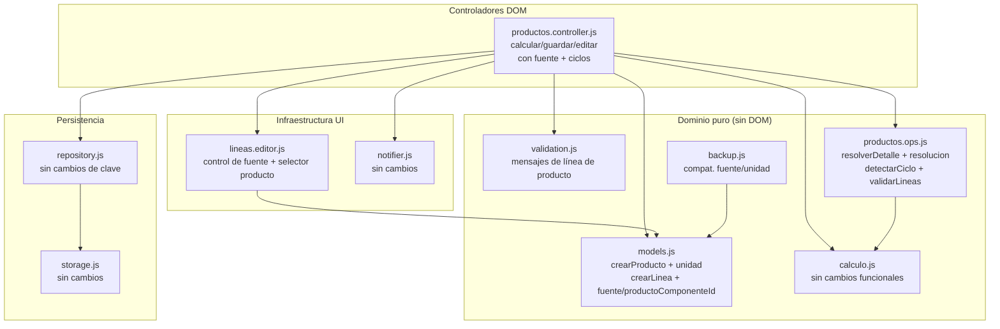
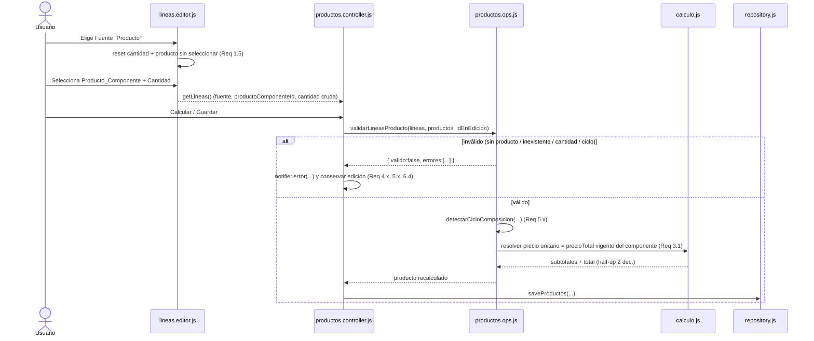
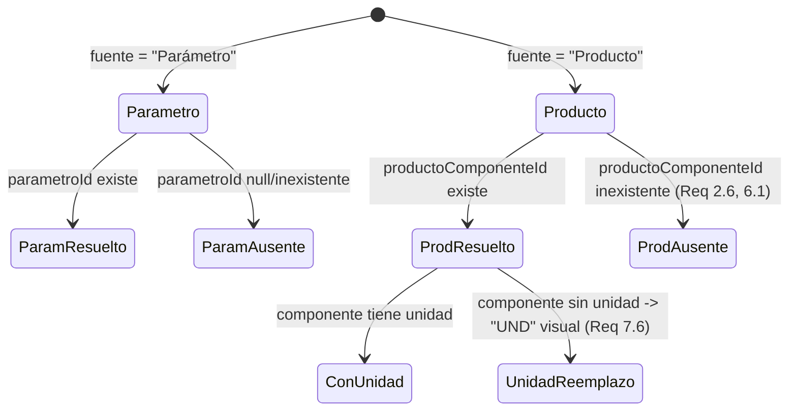

# Documento de Diseño — Producto como componente de línea

## Overview

Esta funcionalidad amplía la creación y edición de Productos de la Aplicacion Limpiapipas para que una `Linea_De_Calculo` pueda tomar su componente de un `Parametro` (comportamiento actual) o de otro `Producto` ya guardado (nuevo). Cuando una línea referencia un `Producto`, el `Precio_Total` vigente de ese `Producto_Componente` actúa como precio unitario del componente y se multiplica por la `Cantidad` para obtener el subtotal de la línea.

El diseño respeta estrictamente la arquitectura existente:

- **JavaScript vanilla puro**, sin framework ni empaquetado. Cada archivo de `src/` es un IIFE `(function (global) { ... })(window)` que publica su API en el espacio de nombres global `window.LP`. No se introduce sintaxis de Módulos ES.
- **Carga como Scripts_Clasicos bajo `file://`** con orden de dependencias en `index.html` (dominio puro → persistencia → infraestructura de UI → controladores → arranque).
- **Moneda PEN** e **interfaz en español**.
- **Separación de capas**: lógica pura (`calculo`, `validation`, `currency`, `models`, `productos.ops`, `backup`), persistencia (`storage`, `repository`), infraestructura de UI (`notifier`, `router`, `lineas.editor`) y controladores DOM (`productos.controller`, etc.).

La estrategia central del cambio consiste en **extender el modelo de datos de `Linea_De_Calculo` de forma retrocompatible** (agregar `fuenteDeComponente` y `productoComponenteId`) y **enriquecer las funciones puras** para resolver el precio unitario según la fuente, detectar ciclos de composición y validar las nuevas condiciones, manteniendo las funciones existentes sin regresiones.

### Trazabilidad de decisiones a requisitos

| Decisión de diseño | Requisitos |
| --- | --- |
| Modelo extendido de `Linea_De_Calculo` (`fuenteDeComponente`, `productoComponenteId`), retrocompatible | 1.2, 7.2, 7.3 |
| Atributo `unidad` en `Producto` ("UND" al crear), sin inventar valor al cargar | 9.1–9.5, 7.7 |
| `Unidad_De_Reemplazo` "UND" solo de visualización | 1.4, 7.6 |
| Editor de líneas con control de fuente + selector de producto + exclusión del propio producto | 1.1–1.6, 2.1–2.6 |
| Resolución de precio unitario de línea de producto = `precioTotal` vigente del componente | 3.1–3.5, 6.3 |
| `Ventana_Detalle` muestra valores almacenados sin recalcular | 6.1, 6.2 |
| Detección de ciclos (directos e indirectos), profundidad 1.000, tope 2 s | 5.1–5.5 |
| Validación al calcular/guardar (sin producto, inexistente, cantidad fuera de rango, combinación) | 4.1–4.5, 6.4 |
| Persistencia y backup con migración/compatibilidad | 7.1–7.5, 8.3, 8.4, 8.7 |
| Preservación de editar/eliminar/exportar/importar | 8.1, 8.2, 8.5, 8.6 |

## Architecture

### Módulos afectados y responsabilidades

El cambio se concentra en la capa de dominio pura (donde vive el grueso de la lógica testeable) y en el editor de líneas + controlador (efectos DOM). La persistencia y el backup solo requieren ajustes de compatibilidad de forma de datos.



### Flujo de datos de una `Linea_De_Producto`



### Orden de carga (index.html) y en pruebas

El orden de carga no cambia. `productos.ops.js` y `lineas.editor.js` ya existen en `ORDEN_SCRIPTS` (`tests/helpers/cargarLP.js`) y solo se extienden. No se agregan archivos nuevos: toda la lógica nueva se ubica en los módulos existentes para respetar el estilo y minimizar el riesgo de regresión.

## Components and Interfaces

Firmas de las funciones nuevas y modificadas, por archivo. Se mantiene el estilo JSDoc y de comentarios del código existente.

### `src/models.js`

```js
/**
 * Crea un Producto con un id único estable.
 * @param {string} nombre
 * @param {Array<LineaDeCalculo>} lineas
 * @param {number} precioTotal
 * @param {string} [unidad="UND"] Unidad_De_Producto; al crear un Producto nuevo vale "UND" (Req 9.1).
 * @returns {{ id, nombre, lineas, precioTotal, unidad }}
 */
function crearProducto(nombre, lineas, precioTotal, unidad = "UND")

/**
 * Valores admitidos de Fuente_De_Componente (Req 1.1).
 * @type {{ PARAMETRO: "Parámetro", PRODUCTO: "Producto" }}
 */
const FUENTE_COMPONENTE = { PARAMETRO: "Parámetro", PRODUCTO: "Producto" };

/**
 * Crea una LineaDeCalculo. Retrocompatible: por defecto es una Linea_De_Parametro
 * (fuenteDeComponente = "Parámetro", productoComponenteId = null) (Req 1.2, 7.2).
 * @param {string|null} [parametroId=null]
 * @param {number|null} [cantidad=null]
 * @param {"Parámetro"|"Producto"} [fuenteDeComponente="Parámetro"]
 * @param {string|null} [productoComponenteId=null]
 * @returns {{ parametroId, cantidad, subtotal, fuenteDeComponente, productoComponenteId }}
 */
function crearLinea(parametroId = null, cantidad = null,
                    fuenteDeComponente = FUENTE_COMPONENTE.PARAMETRO,
                    productoComponenteId = null)

/**
 * Normaliza una Linea_De_Calculo cargada desde almacenamiento/respaldo,
 * completando campos ausentes de datos antiguos (Req 7.2, 7.3).
 * - Si `fuenteDeComponente` está ausente => "Parámetro".
 * - `productoComponenteId` ausente => null.
 * No muta la entrada.
 * @param {object} linea
 * @returns {{ parametroId, cantidad, subtotal, fuenteDeComponente, productoComponenteId }}
 */
function normalizarLinea(linea)
```

Publicación: `LP.models = { generarId, crearParametro, crearProducto, crearLinea, normalizarLinea, FUENTE_COMPONENTE }`.

### `src/lineas.editor.js`

Se extiende `crearEditorDeLineas` para soportar ambas fuentes. Se agrega el accesor `getProductos` y `idProductoEnEdicion` para excluir el propio producto.

```js
/**
 * @param {Object} opciones
 * @param {HTMLElement} [opciones.contenedor]
 * @param {() => Parametro[]} opciones.getParametros
 * @param {() => Producto[]} [opciones.getProductos]      Accesor a los Productos vigentes (Req 2.1).
 * @param {() => (string|null)} [opciones.getIdEnEdicion] Id del Producto_Contenedor en edición, para
 *                                                        excluirlo del selector (Req 2.3). Null en la Calculadora.
 * @param {HTMLElement} [opciones.botonAgregar]
 * @returns {EditorDeLineas}
 */
function crearEditorDeLineas({ contenedor, getParametros, getProductos, getIdEnEdicion, botonAgregar })
```

Comportamiento nuevo del editor (efectos DOM, sin validar ni calcular):

- **Control de fuente por fila**: un `<select>` con "Parámetro" y "Producto"; valor inicial "Parámetro" al agregar (Req 1.1, 1.2).
- **Fuente = "Parámetro"**: muestra el selector de `Parametro`, la `Cantidad` y la `Unidad` del parámetro (comportamiento actual, Req 1.3).
- **Fuente = "Producto"**: muestra el selector de `Producto_Componente` (Productos ordenados alfabéticamente por nombre, Req 2.1), la `Cantidad` y, como `Unidad` de solo lectura, la `Unidad_De_Producto` del componente si está definida o `Unidad_De_Reemplazo` "UND" si no lo está (Req 1.4, 7.6). Sin productos disponibles => indicación "No hay productos disponibles" y línea sin componente (Req 2.2). El propio `Producto_Contenedor` se excluye del listado (Req 2.3).
- **Cambio de fuente**: al alternar Parámetro↔Producto se descarta la referencia previa (`parametroId`/`productoComponenteId` a null) y se restablece la `Cantidad` a "sin ingresar" (Req 1.5, 1.6).
- **Referencia ausente**: si `productoComponenteId` no existe entre los Productos, el selector muestra `Nombre_Producto_Componente_Ausente` y deja la línea sin componente válido (Req 2.6, 8.6).

La forma de línea en edición pasa a incluir `fuenteDeComponente` y `productoComponenteId` junto a `parametroId`, `cantidad` (cruda) y `subtotal`. `setLineas` hace deep-copy normalizando datos antiguos vía `models.normalizarLinea`.

Publicación: `LP.lineasEditor = { crearEditorDeLineas }` (sin cambios de nombre de API).

### `src/productos.ops.js`

Funciones puras nuevas y modificadas.

```js
/**
 * Texto Nombre_Producto_Componente_Ausente (Req 2.6, 6.1).
 * @type {string}
 */
const NOMBRE_PRODUCTO_COMPONENTE_AUSENTE = "Producto no disponible";

/**
 * Unidad_De_Reemplazo de visualización (Req 1.4, 6.1, 7.6).
 * @type {string}
 */
const UNIDAD_DE_REEMPLAZO = "UND";

/**
 * Resuelve las líneas de un Producto para la Ventana_Detalle, en solo lectura,
 * usando los VALORES ALMACENADOS sin recalcular (Req 6.1, 6.2). Ahora distingue
 * la fuente de cada línea:
 *  - Linea_De_Parametro: mapea nombre/unidad del Parametro vigente; ausente =>
 *    NOMBRE_PARAMETRO_AUSENTE, unidad "".
 *  - Linea_De_Producto: mapea nombre/unidad del Producto_Componente vigente;
 *    ausente => NOMBRE_PRODUCTO_COMPONENTE_AUSENTE, unidad "" (Req 6.1). El
 *    subtotal y el precioTotal se muestran tal como fueron almacenados (Req 6.2).
 * @param {Producto} producto
 * @param {Parametro[]} parametros
 * @param {Producto[]} [productos] Lista de Productos vigente, para resolver componentes.
 * @returns {DetalleResuelto}
 */
function resolverDetalle(producto, parametros, productos)

/**
 * Resuelve el Precio_Unitario_De_Componente de una línea según su fuente (Req 3.1):
 *  - "Parámetro": precioUnitario del Parametro referenciado.
 *  - "Producto": precioTotal vigente del Producto_Componente referenciado.
 * Devuelve { ok:true, precioUnitario } o { ok:false, motivo } si el componente
 * no existe o carece de precio (Req 3.2, 6.4).
 * @param {LineaDeCalculo} linea
 * @param {Parametro[]} parametros
 * @param {Producto[]} productos
 * @returns {{ ok: true, precioUnitario: number } | { ok: false, motivo: string }}
 */
function resolverPrecioUnitario(linea, parametros, productos)

/**
 * Recalcula subtotales y precioTotal de un Producto_Contenedor a partir de sus
 * líneas en edición, resolviendo el precio unitario por fuente (Req 3.3, 3.4,
 * 6.3). Half-up a 2 decimales vía calculo. Asume líneas ya validadas. No muta.
 * @param {Array<LineaDeCalculo>} lineas
 * @param {Parametro[]} parametros
 * @param {Producto[]} productos
 * @returns {{ subtotales: number[], total: number }}
 */
function calcularContenedor(lineas, parametros, productos)

/**
 * editarProducto ahora conserva id, nombre y unidad del Producto (Req 8.1, 9.5),
 * recalculando subtotales/total desde el precio unitario resuelto por fuente.
 * @param {Producto[]} productos
 * @param {string} id
 * @param {Array<LineaDeCalculo>} lineasProducto  Incluye fuente/productoComponenteId.
 * @param {Parametro[]} parametros
 * @returns {Producto[]}
 */
function editarProducto(productos, id, lineasProducto, parametros)

/**
 * eliminarProducto: quita el Producto y, para cada Linea_De_Producto de otros
 * Productos que lo referenciaba, la marca como referencia no resuelta
 * conservando Cantidad y subtotal almacenado sin recalcular (Req 8.2). No muta.
 * @param {Producto[]} productos
 * @param {string} id
 * @returns {Producto[]}
 */
function eliminarProducto(productos, id)

/**
 * Detecta un Ciclo_De_Composicion que resultaría de asignar `lineas` al Producto
 * `idContenedor` dentro de la lista `productos` (Req 5.1–5.5). Recorrido
 * transitivo en profundidad, con:
 *  - detección de ciclo directo e indirecto que regrese a `idContenedor`;
 *  - límite de 1.000 Productos distintos visitados (Req 5.3, 5.4);
 *  - tope de tiempo de 2.000 ms (Req 5.3), medido con Date.now();
 *  - detección de referencia a Producto no resoluble (Req 5.5).
 * @param {string} idContenedor
 * @param {Array<LineaDeCalculo>} lineas
 * @param {Producto[]} productos
 * @returns {{ hayCiclo: false }
 *          | { hayCiclo: true, tipo: "directo"|"indirecto", secuencia: string[] }
 *          | { hayCiclo: true, tipo: "profundidad" }
 *          | { hayCiclo: true, tipo: "tiempo" }
 *          | { hayCiclo: true, tipo: "referencia-no-resoluble", productoId: string }}
 */
function detectarCicloComposicion(idContenedor, lineas, productos)

/**
 * Valida las Lineas_De_Producto de un Producto_Contenedor al calcular/guardar,
 * acumulando TODOS los errores por línea (Req 4.1–4.5). Devuelve el índice de
 * cada línea con error y su categoría, para que el controlador señale cada una.
 * @param {Array<LineaDeCalculo>} lineas
 * @param {Producto[]} productos
 * @param {string|null} idEnEdicion
 * @returns {{ valido: true }
 *          | { valido: false, errores: Array<{ indice: number,
 *              tipo: "sin-producto"|"producto-inexistente"|"cantidad-invalida" }> }}
 */
function validarLineasProducto(lineas, productos, idEnEdicion)
```

Publicación: `LP.productosOps = { NOMBRE_PARAMETRO_AUSENTE, NOMBRE_PRODUCTO_COMPONENTE_AUSENTE, UNIDAD_DE_REEMPLAZO, resolverDetalle, resolverPrecioUnitario, calcularContenedor, editarProducto, eliminarProducto, detectarCicloComposicion, validarLineasProducto }`.

### `src/validation.js`

Se agregan los mensajes exactos exigidos por los criterios de línea de producto y ciclos, y validadores derivados. Los validadores numéricos existentes (`validarCantidad`) se reutilizan tal cual.

```js
const MENSAJES = {
  // ...existentes...
  LINEA_SIN_PRODUCTO:
    "Cada línea debe tener un producto seleccionado.",           // Req 4.1, 4.2, 6.4
  CICLO_DIRECTO:
    "Un producto no puede contenerse a sí mismo.",               // Req 5.1
  CICLO_INDIRECTO:
    "La composición generaría una referencia circular entre productos.", // Req 5.2
  COMPOSICION_DEMASIADO_PROFUNDA:
    "La composición es demasiado profunda para verificarse.",    // Req 5.4
  REFERENCIA_PRODUCTO_NO_DISPONIBLE:
    "Existe una referencia a un producto no disponible.",        // Req 5.5, 6.4
};
```

### `src/backup.js`

`serializarRespaldo`/`parsearRespaldo` mantienen su firma. `parsearRespaldo` sigue devolviendo la lista de Productos tal cual; la **normalización de compatibilidad** (fuente ausente => "Parámetro", `unidad` no inventada) la aplica el controlador de base de datos al importar, reutilizando `models.normalizarLinea` sobre las líneas y dejando `unidad` sin cambios si no está definida (Req 7.7, 9.4). El round-trip persiste `fuenteDeComponente`, `productoComponenteId`, `unidad`, `cantidad` y `subtotal` porque son campos del objeto Producto/Linea que `JSON.stringify` ya serializa (Req 7.1, 7.4, 8.3, 8.4).

### `src/productos.controller.js`

Cambios en la Calculadora y la Ventana_Edicion:

- Al instanciar el editor de líneas, pasar `getProductos` y (en edición) `getIdEnEdicion` para excluir el propio producto (Req 2.3).
- En `calcular`/`guardar`/`guardarEdicion`: sustituir la validación línea-a-línea propia por `validarLineasProducto` para las líneas de producto (acumulando errores y señalando cada línea, Req 4.5), y ejecutar `detectarCicloComposicion` antes de recalcular (Req 5.1, 5.2). Ante error, `notifier.error(...)` con el mensaje exacto y conservar la edición.
- Recalcular subtotales/total con `productosOps.calcularContenedor` (resuelve el precio unitario por fuente) y persistir con `repository.saveProductos`. Fallo de escritura => `MENSAJE_NO_PERSISTENTE` (Req 7.5).
- Al construir un Producto nuevo, `crearProducto(nombre, lineas, total)` fija `unidad = "UND"` (Req 9.1). Al editar, `editarProducto` conserva la `unidad` previa (Req 9.5).

## Data Models

### `Producto` — antes y después

```js
// Antes
{ id, nombre, lineas, precioTotal }
// Después (Req 9.x)
{ id, nombre, lineas, precioTotal, unidad }   // unidad: "UND" al crear
```

Nota de compatibilidad: un Producto cargado sin `unidad` se mantiene **sin `unidad` definida**; la Aplicacion no inventa ni persiste un valor (Req 7.7, 9.4). En el Selector_De_Linea, si el componente no tiene `unidad`, se muestra `Unidad_De_Reemplazo` "UND" solo como visualización (Req 1.4, 7.6).

### `Linea_De_Calculo` — antes y después

```js
// Antes (Linea_De_Parametro)
{ parametroId, cantidad, subtotal }
// Después
{
  parametroId,            // usado cuando fuenteDeComponente === "Parámetro"
  productoComponenteId,   // usado cuando fuenteDeComponente === "Producto" (Req 2.5)
  cantidad,
  subtotal,
  fuenteDeComponente      // "Parámetro" | "Producto"
}
```

Nota de compatibilidad (Req 7.2, 7.3): una línea cargada **sin** `fuenteDeComponente` se interpreta como `"Parámetro"` (Linea_De_Parametro) y `productoComponenteId` ausente equivale a `null`. La normalización se realiza en `models.normalizarLinea`, invocada por `lineas.editor.setLineas`, por `resolverDetalle` y por el controlador de importación. Las líneas antiguas `{ parametroId, cantidad, subtotal }` siguen calculándose y mostrándose exactamente igual que antes.

### `Archivo_De_Respaldo`

```js
{ version, parametros: Parametro[], productos: Producto[] }   // forma sin cambios
```

Los Productos incluyen ahora `unidad` y sus líneas incluyen `fuenteDeComponente`/`productoComponenteId`. La forma del envoltorio no cambia; la versión (`"1"`) se mantiene porque la lectura es retrocompatible por normalización (Req 8.3, 8.4).

### Estados de resolución de una línea (visualización)



## Correctness Properties

*Una propiedad es una característica o comportamiento que debe cumplirse en todas las ejecuciones válidas de un sistema: es un enunciado formal de lo que el sistema debe hacer. Las propiedades son el puente entre las especificaciones legibles por humanos y las garantías de corrección verificables por máquina.*

Las propiedades siguientes son la salida de la fase de *prework* de análisis de criterios de aceptación. Cada una es una función pura testeable con `fast-check` (el proyecto ya usa `*.property.test.js` con `fast-check` + `vitest`, `numRuns: 100`). Los criterios de UI (render, foco, no-editabilidad, transiciones de estado del DOM) y los de infraestructura (fallo de escritura en `localStorage`) se cubren con tests de ejemplo/integración en la Testing Strategy, no con propiedades.

### Property 1: La línea nueva es una Linea_De_Parametro por defecto

*Para toda* invocación de `models.crearLinea` sin especificar la fuente, la línea resultante tiene `fuenteDeComponente === "Parámetro"` y `productoComponenteId === null`.

**Validates: Requirements 1.2**

### Property 2: El Producto nuevo tiene Unidad_De_Producto "UND"

*Para todo* nombre, conjunto de líneas y precio total, `models.crearProducto(nombre, lineas, precioTotal)` produce un Producto con `unidad === "UND"`.

**Validates: Requirements 9.1**

### Property 3: La normalización interpreta datos antiguos de forma retrocompatible

*Para toda* `Linea_De_Calculo` sin `fuenteDeComponente`, `models.normalizarLinea` devuelve una línea con `fuenteDeComponente === "Parámetro"` y `productoComponenteId === null`, conservando `parametroId`, `cantidad` y `subtotal`; y *para todo* Producto sin `unidad`, la carga/normalización no agrega ni inventa un valor de `unidad`.

**Validates: Requirements 7.2, 7.7**

### Property 4: El listado de componentes está ordenado y excluye el contenedor

*Para toda* lista de Productos y todo `idEnEdicion` presente en ella, la lista ofrecida como Producto_Componente está ordenada de forma ascendente por nombre y no contiene el Producto de `idEnEdicion`, conservando todos los demás.

**Validates: Requirements 2.1, 2.3**

### Property 5: La Unidad de visualización usa la Unidad_De_Reemplazo sin mutar

*Para todo* Producto_Componente, la Unidad de visualización de una Linea_De_Producto es la `Unidad_De_Producto` del componente si está definida, o `"UND"` (Unidad_De_Reemplazo) si no lo está, y la resolución no modifica el Producto_Componente.

**Validates: Requirements 1.4, 7.6**

### Property 6: El precio unitario se resuelve según la fuente de la línea

*Para toda* línea con componente existente, `resolverPrecioUnitario` devuelve el `precioUnitario` del `Parametro` cuando la fuente es "Parámetro" y el `precioTotal` vigente del `Producto_Componente` cuando la fuente es "Producto".

**Validates: Requirements 3.1, 7.3**

### Property 7: El precio unitario falla cuando el componente no es resoluble

*Para toda* Linea_De_Producto cuyo `Producto_Componente` no existe o carece de `precioTotal`, `resolverPrecioUnitario` devuelve `{ ok: false }`.

**Validates: Requirements 3.2**

### Property 8: El cálculo del contenedor es consistente con el redondeo half-up

*Para todo* contenedor cuyas líneas tienen componente resoluble, `calcularContenedor` produce `subtotal_i = redondear2(cantidad_i * precioUnitario_i)` para cada línea y `total = redondear2(suma de subtotales)`; para un contenedor sin líneas, `total === 0`.

**Validates: Requirements 3.3, 3.4, 3.5**

### Property 9: La edición conserva identidad y recalcula por fuente

*Para todo* Producto_Contenedor editado con líneas válidas de fuentes mixtas, `editarProducto` conserva `id`, `nombre` y `unidad` del Producto y recalcula cada `subtotal` y el `precioTotal` con el precio unitario resuelto por fuente (`precioTotal` vigente para los componentes de tipo Producto).

**Validates: Requirements 6.3, 8.1, 9.5**

### Property 10: La eliminación preserva a los demás y deja referencias no resueltas

*Para toda* lista de Productos e `id` eliminado, `eliminarProducto` quita el Producto de `id`, conserva los `subtotal` y `precioTotal` almacenados de los demás Productos sin recalcular, y cada Linea_De_Producto que referenciaba ese `id` conserva su `Cantidad` y su `subtotal` almacenado como referencia no resuelta.

**Validates: Requirements 8.2**

### Property 11: El detalle marca componentes ausentes y preserva valores almacenados

*Para todo* Producto, `resolverDetalle` preserva el `precioTotal` almacenado y el `subtotal` almacenado de cada línea sin recalcular; y *para toda* Linea_De_Producto cuyo componente ya no existe, la marca como ausente con `Nombre_Producto_Componente_Ausente` y Unidad vacía.

**Validates: Requirements 2.6, 6.1, 6.2**

### Property 12: La validación acumula todos los errores por línea

*Para toda* lista de líneas en la que se inyectan errores (línea de producto sin componente, con componente inexistente, o con cantidad fuera de `0,01..999.999.999,99`) en un subconjunto de índices, `validarLineasProducto` devuelve `valido === false` con exactamente ese conjunto de índices marcados y la categoría correcta por línea; y si ninguna línea tiene error, devuelve `valido === true`.

**Validates: Requirements 4.1, 4.2, 4.3, 4.4, 4.5**

### Property 13: La detección de ciclos identifica ciclos y referencias no resolubles

*Para todo* grafo de composición: si alguna línea del contenedor referencia al propio `idContenedor`, `detectarCicloComposicion` devuelve un ciclo directo; si las referencias forman un camino transitivo que regresa al contenedor, devuelve un ciclo indirecto con la secuencia de Productos que lo forman; y si el recorrido alcanza una referencia a un Producto que no existe, devuelve `referencia-no-resoluble`.

**Validates: Requirements 5.1, 5.2, 5.3, 5.5**

### Property 14: El respaldo preserva líneas de producto, referencias y unidad (round-trip)

*Para toda* lista de Productos con Lineas_De_Producto y Lineas_De_Parametro (incluidas referencias colgantes), `parsearRespaldo(serializarRespaldo(parametros, productos))` devuelve un resultado `ok` cuya lista de Productos es equivalente a la original: mismos `id`, `nombre`, `unidad` y `precioTotal`, y por línea la misma `fuenteDeComponente`, `parametroId`, `productoComponenteId`, `Cantidad` y `subtotal`, en el mismo orden.

**Validates: Requirements 7.1, 7.4, 8.3, 8.7, 9.2, 9.3, 9.4**

## Error Handling

El manejo de errores sigue el patrón existente: las funciones puras devuelven resultados tipados (no lanzan), y los controladores traducen esos resultados en mensajes de `notifier.error(...)` conservando los datos en edición.

| Condición | Detección | Respuesta | Requisitos |
| --- | --- | --- | --- |
| Cantidad no numérica / fuera de rango | `validarLineasProducto` (reutiliza `validation.validarCantidad`) | `notifier.error(MENSAJES.CANTIDAD_INVALIDA)`, conservar edición | 1.7, 1.8, 4.3 |
| Línea de producto sin componente | `validarLineasProducto` → `sin-producto` | `notifier.error(MENSAJES.LINEA_SIN_PRODUCTO)`, señalar cada línea | 4.1, 4.5 |
| Componente inexistente | `validarLineasProducto` → `producto-inexistente` | `notifier.error(MENSAJES.LINEA_SIN_PRODUCTO)` / rechazo de guardado | 4.2, 6.4 |
| Componente sin precio al calcular | `resolverPrecioUnitario` `{ ok:false }` | `notifier.error(REFERENCIA_PRODUCTO_NO_DISPONIBLE)`, conservar edición | 3.2 |
| Ciclo directo (auto-referencia) | `detectarCicloComposicion` tipo `directo` | `notifier.error(CICLO_DIRECTO)`, conservar edición | 5.1 |
| Ciclo indirecto | `detectarCicloComposicion` tipo `indirecto` (+ secuencia) | `notifier.error(CICLO_INDIRECTO + secuencia)`, conservar edición | 5.2 |
| Profundidad > 1.000 / tiempo > 2 s | `detectarCicloComposicion` tipo `profundidad`/`tiempo` | `notifier.error(COMPOSICION_DEMASIADO_PROFUNDA)`, conservar edición | 5.3, 5.4 |
| Referencia colgante en el recorrido | `detectarCicloComposicion` tipo `referencia-no-resoluble` | `notifier.error(REFERENCIA_PRODUCTO_NO_DISPONIBLE)`, conservar edición | 5.5 |
| Fallo de escritura en `localStorage` | `repository.saveProductos` → `WriteResult failed` | Aplicar estado en memoria + `notifier.error(MENSAJE_NO_PERSISTENTE)` | 7.5 |
| Respaldo inválido al importar | `backup.parsearRespaldo` → `invalid` | `notifier.error(reason)`, conservar Productos existentes | 8.5 |
| Referencia colgante al importar/editar | Normalización + `resolverDetalle`/editor | Mostrar como referencia no resuelta, conservar Cantidad/subtotal, permitir reasignar/eliminar | 8.6, 8.7 |
| DOM ausente (fallback `file://`) | Guardas contra `null` en el editor y controlador | Degradación segura, sin lanzar | transversal |

Notas de degradación segura (coherentes con el código actual): todos los accesos al DOM se guardan contra `null`; `storage`/`repository` nunca propagan excepciones; `notifier` cae a `console` si no hay contenedor; y el recorrido de ciclos usa `Date.now()` para el tope de 2 s sin bloquear indefinidamente.

## Testing Strategy

El proyecto usa `vitest` (entorno `jsdom`, `vitest run`, sin watch) con pruebas co-locadas en `src/**/*.test.js` y en `tests/**/*.test.js`, y `fast-check` para las pruebas de propiedad. Los Scripts_Clasicos se cargan con el helper `tests/helpers/cargarLP.js` (`cargarModulos`), que evalúa los IIFE de `src/` sobre el `window` de jsdom y puebla `window.LP`. **No se implementa PBT desde cero**: se usa `fast-check`, con `numRuns: 100` por propiedad.

### Aplicabilidad de PBT

PBT **aplica** a la lógica pura de esta funcionalidad (fábricas y normalización en `models`, resolución/validación/detección de ciclos/cálculo en `productos.ops`, round-trip en `backup`): son funciones con entrada/salida clara y propiedades universales (invariantes, round-trip, condiciones de error). PBT **no aplica** al render del editor de líneas, al foco, a la no-editabilidad de la unidad, a las transiciones de estado del DOM ni al fallo de escritura de `localStorage`; esos se cubren con tests de ejemplo (jsdom) e integración.

### Pruebas de propiedad (fast-check, `numRuns: 100`)

Cada propiedad del diseño se implementa con **un único** test de propiedad, etiquetado con un comentario:

`// Feature: producto-como-componente-de-linea, Property {N}: {texto}`

Ubicación sugerida (siguiendo la convención `*.property.test.js`):

- `tests/models.componente.property.test.js` — Property 1, 2, 3.
- `tests/productos.ops.componente.property.test.js` — Property 4, 5, 6, 7, 8, 9, 10, 11, 12, 13.
- `tests/backup.componente.roundtrip.property.test.js` — Property 14 (extiende la Property 10 de backup ya existente con `fuenteDeComponente`, `productoComponenteId` y `unidad`).

Generadores clave (arbitraries): listas de Parametros y Productos con ids únicos (reutilizando el patrón `param-i` / `prod-i` de las suites actuales); líneas mixtas con `fuenteDeComponente` en `{ "Parámetro", "Producto" }`; subtotales coherentes con `redondear2(cantidad * precioUnitario)` para mantener el recálculo determinista (mismas cotas de `arbCantidadEdicion` que en `productos.ops.property.test.js`); y grafos de composición generados como cadenas para forzar ciclos indirectos (`A→B→…→A`) y referencias colgantes.

### Pruebas de ejemplo / edge (unit + jsdom)

- Editor de líneas (`tests/lineas.editor.componente.test.js`): control de fuente presente con ambas opciones (1.1); render por fuente y unidad de reemplazo no editable (1.3, 1.4); reset de cantidad y descarte de referencia al cambiar de fuente (1.5, 1.6); lista vacía de productos (2.2); reemplazo/registro de `productoComponenteId` (2.4, 2.5); referencia colgante mostrada como no resuelta con preservación (8.6); exclusión del contenedor en edición (2.3, como ejemplo complementario a Property 4).
- Cantidad inválida conserva la última válida y muestra error (1.8).
- Ciclos: cadena lineal > 1.000 sin ciclo fuerza tipo `profundidad` (5.4).
- Importación: JSON/estructura inválida => `invalid`, sin cambios (8.5); importar con acciones Ver/Editar/Eliminar disponibles (8.4).
- Persistencia: `writeJSON` simulado `failed` => `MENSAJE_NO_PERSISTENTE` y estado conservado (7.5).

### Regresión (no deben romperse)

Los siguientes tests existentes deben seguir pasando sin modificación de comportamiento; la extensión del modelo es retrocompatible (líneas sin fuente => `Linea_De_Parametro`, Producto sin `unidad` => sin unidad):

- `tests/productos.ops.property.test.js` (Properties 1–6, 9 de `product-detail-edit-delete`).
- `tests/backup.roundtrip.property.test.js` (Property 10 de backup).
- `tests/calculadora.regression.test.js`, `tests/lineas.editor.test.js`, `tests/ventana.detalle.test.js`, `tests/ventana.edicion.test.js`, `tests/lista.productos.test.js`, `tests/eliminacion.test.js`, `tests/persistencia.integracion.test.js`, `tests/exportar.importar.integracion.test.js`, `tests/setup.smoke.test.js`.

Al ajustar las firmas de `editarProducto`/`resolverDetalle` (parámetro adicional `productos`/`parametros`), se mantendrá la compatibilidad haciendo el nuevo argumento opcional con valor por defecto seguro, de modo que las llamadas existentes en las suites de `product-detail-edit-delete` sigan resolviendo Lineas_De_Parametro con el mismo comportamiento previo (Req 7.3).
