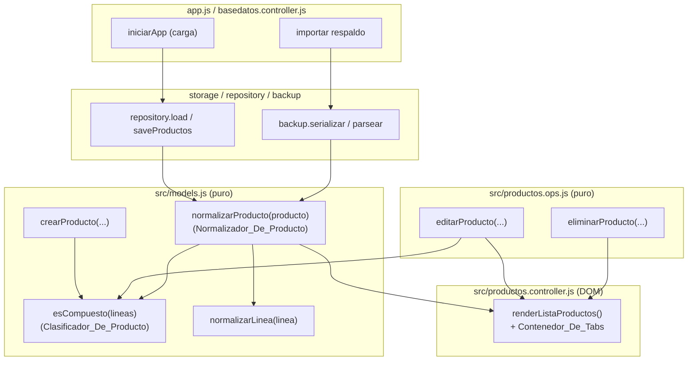
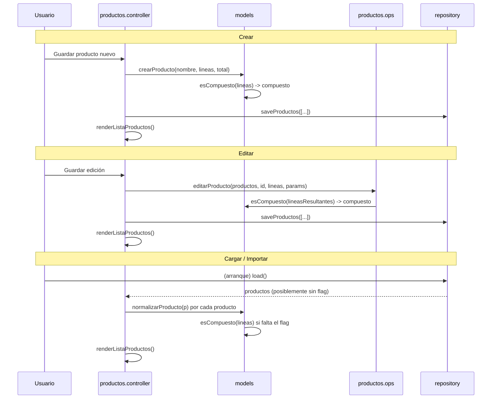
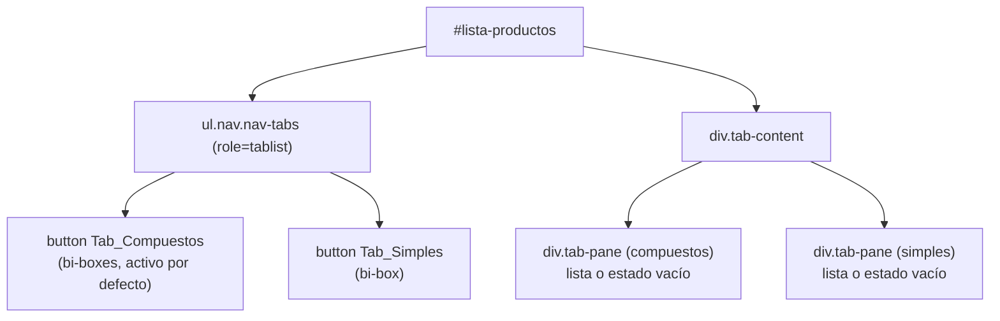

# Documento de Diseño

## Overview

Esta funcionalidad introduce una clasificación automática de cada Producto como
SIMPLE o COMPUESTO y reorganiza la Lista_De_Productos en dos pestañas (tabs) que
separan ambos grupos. La clasificación se materializa en un campo booleano
interno `compuesto` (el Flag_Compuesto) que se deriva exclusivamente de las
Lineas_De_Calculo del Producto: un Producto es COMPUESTO si tiene al menos una
Linea_De_Producto (`fuenteDeComponente === "Producto"`), y SIMPLE en caso
contrario.

El diseño se apoya en el patrón ya establecido en el proyecto:

- **Lógica pura sin efectos** en `src/models.js` y `src/productos.ops.js`
  (fábricas, clasificador, normalizador y operaciones sobre la lista).
- **Efectos de DOM** en `src/productos.controller.js` (render de la
  Lista_De_Productos y su nuevo Contenedor_De_Tabs).
- **Persistencia y respaldo** en `src/repository.js`, `src/storage.js`,
  `src/backup.js`, más el arranque en `src/app.js` y la importación en
  `src/basedatos.controller.js`.

El objetivo de diseño principal es que exista **una única regla de
clasificación** (el Clasificador_De_Producto) usada de forma consistente por la
creación, la edición y la normalización, para que ante las mismas líneas siempre
se obtenga la misma clasificación (Req 3). El flag es un dato interno: se
persiste y respalda, pero **no se muestra ni se edita** en las ventanas de
detalle y edición (Req 9).

Todo el código nuevo mantiene el estilo del proyecto: JavaScript vanilla
(Scripts_Clasicos bajo `file://`, sin módulos ES, espacio de nombres
`window.LP`), comentarios y nombres en español, y referencias a los requisitos.

### Alcance por requisito

| Requisito | Dónde se resuelve |
| --- | --- |
| 1. Clasificación al crear | `models.crearProducto` + `models.esCompuesto` |
| 2. Clasificación al actualizar | `productosOps.editarProducto` + `models.esCompuesto` |
| 3. Regla del Clasificador | `models.esCompuesto` (función pura única) |
| 4. Retrocompatibilidad al cargar/importar | `models.normalizarProducto` en `app.js` y `basedatos.controller.js` |
| 5. Persistencia y respaldo del flag | `repository`/`storage` (roundtrip localStorage) y `backup` (roundtrip JSON) |
| 6. Separación en pestañas | `productosController.renderListaProductos` (Contenedor_De_Tabs) |
| 7. Selección por defecto y rótulos | `productosController` (Tab_Compuestos activo, iconos) |
| 8. Estado vacío por pestaña | `productosController` (mensajes por panel) |
| 9. Ocultamiento del flag en UI | detalle y edición no leen ni exponen `compuesto` |

## Architecture

### Diagrama de componentes



### Flujo de la clasificación

El Flag_Compuesto se fija o recalcula en tres puntos, todos delegando en el
mismo Clasificador_De_Producto (`models.esCompuesto`):



### Principios de diseño respetados

- **Sin sintaxis de módulos ES**: todo se publica en `window.LP.*` desde IIFE.
- **Funciones puras aisladas**: el clasificador y el normalizador no mutan sus
  entradas ni tocan el DOM ni `localStorage`.
- **Degradación segura**: el render de tabs debe funcionar con y sin la API de
  Bootstrap JS, replicando el patrón de fallback manual que ya usan los modales.
- **Orden de carga**: `models.js` se carga antes que `productos.ops.js` y
  `productos.controller.js` (igual que hoy), por lo que `esCompuesto` está
  disponible para ambos. `productos.ops.js` accede a `LP.models` en tiempo de
  llamada con un fallback seguro, como ya hace con `FUENTE_COMPONENTE`.

## Components and Interfaces

### 1. Clasificador_De_Producto — `models.esCompuesto(lineas)`

Función pura nueva en `src/models.js`. Es la **única** regla de clasificación
(Req 3), reutilizada por `crearProducto`, `editarProducto` y
`normalizarProducto`.

```js
/**
 * Clasificador_De_Producto: determina el Flag_Compuesto a partir de las
 * Lineas_De_Calculo (Req 3.1–3.5). Devuelve true si existe al menos una
 * Linea_De_Producto (fuenteDeComponente === "Producto"); false si el conjunto
 * está vacío o es null/no-array. Una línea sin `fuenteDeComponente` registrada
 * se interpreta como Linea_De_Parametro y NO cuenta como Linea_De_Producto
 * (Req 3.4). No muta las líneas evaluadas (Req 3.5).
 * @param {Array<{ fuenteDeComponente?: string }>|null|undefined} lineas
 * @returns {boolean}
 */
function esCompuesto(lineas) { ... }
```

Reglas (Req 3):

- Conjunto vacío o `null`/no-array → `false` (Req 3.3).
- Al menos una línea con `fuenteDeComponente === FUENTE_COMPONENTE.PRODUCTO` →
  `true` (Req 3.1).
- Ninguna Linea_De_Producto → `false` (Req 3.2).
- `fuenteDeComponente` ausente/`null` → tratada como Linea_De_Parametro
  (Req 3.4); no cuenta.
- No modifica las líneas (Req 3.5).

Se publica en `LP.models` junto al resto de las fábricas.

### 2. `models.crearProducto(nombre, lineas, precioTotal, unidad="UND")`

Se amplía para incluir el campo `compuesto` derivado de `esCompuesto(lineas)`
(Req 1). Conserva `id`, `nombre`, `lineas`, `precioTotal` y `unidad` con los
mismos valores que hoy (Req 1.4).

```js
function crearProducto(nombre, lineas, precioTotal, unidad = "UND") {
  return {
    id: generarId(),
    nombre,
    lineas,
    precioTotal,
    unidad,
    compuesto: esCompuesto(lineas), // Flag_Compuesto (Req 1.1–1.3)
  };
}
```

### 3. Normalizador_De_Producto — `models.normalizarProducto(producto)`

Función pura nueva en `src/models.js` (Req 4). Completa el Flag_Compuesto de un
Producto cargado que no lo tiene, derivándolo con `esCompuesto`, y conserva el
resto de los campos.

```js
/**
 * Normalizador_De_Producto (Req 4.1–4.3). Devuelve una copia del Producto con el
 * Flag_Compuesto garantizado:
 *  - Si `compuesto` ya es booleano, se conserva SIN recalcular (Req 4.2).
 *  - En otro caso, se deriva de las líneas con `esCompuesto` (Req 4.1).
 * Conserva `id`, `nombre`, `lineas`, `precioTotal` y `unidad` (Req 4.3). No muta
 * la entrada.
 * @param {object} producto
 * @returns {object}
 */
function normalizarProducto(producto) { ... }
```

Decisiones:

- **Solo se recalcula si el flag no es booleano** (`undefined`, `null` u otro
  tipo). Un `true`/`false` registrado se respeta (Req 4.2). Esto evita que la
  normalización "corrija" datos deliberados y hace la operación idempotente.
- **No normaliza las líneas en sí** aquí: la normalización de líneas antiguas
  (`fuenteDeComponente` ausente) ya la hace `normalizarLinea` donde corresponde
  (editor de líneas). Como `esCompuesto` interpreta la ausencia de
  `fuenteDeComponente` como Parámetro, la clasificación es correcta aun sobre
  líneas no normalizadas, sin necesidad de mutarlas. Se documenta que
  `normalizarProducto` puede, de forma opcional y sin cambiar la clasificación,
  aplicar `normalizarLinea` a cada línea para dejar la forma completa; el diseño
  recomienda **no** hacerlo para no alterar la forma persistida más allá del
  flag (mínima intervención, coherente con `parsearRespaldo` que devuelve los
  productos tal cual).

Se publica en `LP.models`.

### 4. `productosOps.editarProducto(productos, id, lineasProducto, parametros)`

Se amplía para recalcular el Flag_Compuesto del Producto editado a partir de sus
líneas resultantes, usando `esCompuesto` (Req 2). Conserva `id`, `nombre` y
`unidad` como hoy (Req 2.4) y no altera los demás Productos ni el orden
(Req 2.5).

El objeto `editado` que hoy construye la función añade:

```js
const editado = {
  id: producto.id,
  nombre: producto.nombre,
  lineas,
  precioTotal: calculo.redondear2(total),
  compuesto: LP.models.esCompuesto(lineas), // recalculado (Req 2.1–2.3)
};
if (producto.unidad !== undefined) editado.unidad = producto.unidad;
```

Se accede a `LP.models.esCompuesto` en tiempo de llamada con un fallback seguro
(mismo patrón que `FUENTE_COMPONENTE` en este archivo), para no depender del
orden de evaluación de los IIFE.

### 5. `productosOps.eliminarProducto(productos, id)` — referencias colgantes

**No cambia su implementación**, pero el diseño documenta explícitamente su
interacción con el flag (decisión de diseño clave; ver "Decisiones de diseño"):

Tras eliminar un Producto referenciado, las Lineas_De_Producto colgantes de los
contenedores conservan `fuenteDeComponente === "Producto"` (solo se pone
`productoComponenteId = null`). Como el Flag_Compuesto depende **exclusivamente**
de `fuenteDeComponente` (Req 3.5), el contenedor **sigue clasificándose como
COMPUESTO** aunque la referencia ya no resuelva. `eliminarProducto` no recalcula
el flag de los contenedores afectados (conserva su `compuesto` almacenado, que
sigue siendo coherente con `esCompuesto` sobre sus líneas). Este comportamiento
es intencional y consistente con la regla del clasificador.

### 6. Contenedor_De_Tabs — `productosController.renderListaProductos()`

El render de la Lista_De_Productos se reestructura para separar los Productos en
dos pestañas Bootstrap. El markup se **crea dinámicamente** dentro de
`#lista-productos` (coherente con el resto del controlador, que ya construye
toda la lista con `document.createElement`; `#lista-productos` está vacío en
`index.html`). No se añade markup estático de tabs a `index.html`.

Estructura generada dentro de `#lista-productos`:



Responsabilidades:

- **Partición**: separar `getProductos()` en compuestos (`compuesto === true`) y
  simples (resto) (Req 6.2, 6.3). El criterio para "simple" es
  `!producto.compuesto`, robusto ante un flag ausente (un Producto no
  normalizado se trata como simple en el peor caso, pero el flujo de carga
  garantiza la normalización previa).
- **Orden**: aplicar `ordenarProductos(lista, direccionDeOrden)` a **cada**
  pestaña, con la Direccion_De_Orden vigente (Req 6.6). El Boton_De_Orden y su
  comportamiento se conservan intactos y re-renderizan ambas pestañas.
- **Tarjeta y acciones idénticas**: cada Producto se renderiza con la **misma**
  función de construcción de `<li>` actual (nombre, badge de Precio_Total,
  Badge_Sugerido, botones Ver detalle / Editar / Eliminar con su cableado por
  `data-id`) (Req 6.4). Se extrae un helper `construirItemProducto(producto)`
  que devuelve el `<li>` ya cableado, reutilizado por ambos paneles, para no
  duplicar la lógica de tarjetas.
- **Selección por defecto y rótulos** (Req 7): Tab_Compuestos primero y activo
  (`active`/`show` en su pestaña y panel); Tab_Simples segundo, no activo.
  Rótulos y iconos: `"Productos compuestos"` con `<i class="bi bi-boxes">` y
  `"Productos simples"` con `<i class="bi bi-box">`.
- **Estado vacío por panel** (Req 8):
  - Sin ningún Producto guardado → se conserva la indicación global actual
    ("No hay productos guardados.", clase `lp-productos-vacios`), **sin** tabs
    (Req 8.1). Este chequeo se mantiene antes de construir el Contenedor_De_Tabs,
    como hoy.
  - Con al menos un Producto pero Tab_Compuestos vacío → mensaje "No hay
    productos compuestos." en su panel (Req 8.2).
  - Con al menos un Producto pero Tab_Simples vacío → mensaje "No hay productos
    simples." en su panel (Req 8.3).
- **Re-render tras cambios** (Req 6.5): guardar, editar y eliminar ya llaman a
  `renderListaProductos()`; al reconstruir los tabs desde cero en cada render, la
  clasificación mostrada siempre refleja el estado actual.

#### Activación de pestañas: con y sin Bootstrap JS

Siguiendo el patrón de `hayBootstrapModal()`/fallback manual de los modales, se
introduce `activarTab(boton, panel)` y un cableado de clics:

- **Con Bootstrap JS** (`window.bootstrap && window.bootstrap.Tab`): se puede
  usar `bootstrap.Tab.getOrCreateInstance(boton).show()` o, de forma más simple
  y suficiente, dejar que los atributos `data-bs-toggle="tab"` y
  `data-bs-target` gestionen la conmutación nativamente. El diseño añade además
  un manejador propio de respaldo (idempotente) para no depender del binding
  automático sobre nodos creados dinámicamente.
- **Sin Bootstrap JS** (fallback manual): un listener de `click` en cada botón
  alterna las clases:
  - En los botones: quita `active` de ambos, agrega `active` al pulsado y fija
    `aria-selected` (`true`/`false`).
  - En los paneles: quita `show`/`active` de ambos, agrega `show active` al panel
    correspondiente (Bootstrap usa `.tab-pane.active.show` para mostrar; el panel
    inactivo queda sin `show active`, oculto por el CSS de Bootstrap). Como
    respaldo adicional para entornos sin el CSS aplicado, el fallback también
    alterna `d-none` en los paneles, igual que hace el fallback de modales
    (Req 7.4).

Este manejador manual funciona en ambos casos (con y sin la API de Bootstrap), y
al reconstruirse en cada render no acumula listeners sobre nodos viejos (los
nodos anteriores se descartan al vaciar `#lista-productos`).

### 7. Detalle y edición — sin exposición del flag (Req 9)

- `abrirDetalle(id)` y `resolverDetalle(...)` **no leen ni muestran**
  `compuesto`. `resolverDetalle` ya solo produce nombre, precioTotal y líneas; no
  requiere cambios (Req 9.1).
- `abrirEdicion(id)` / `guardarEdicion()` **no añaden** ningún control del flag.
  El flag se recalcula en `editarProducto` a partir de las líneas, sin
  intervención del usuario (Req 9.2, 9.3). No se requieren cambios en el editor
  de líneas.

### 8. Persistencia y respaldo (Req 5)

- **localStorage** (`repository.saveProductos` → `storage.writeJSON`): serializa
  el arreglo de Productos completo con `JSON.stringify`; como `compuesto` es un
  campo plano del objeto Producto, se persiste y se lee sin cambios (Req 5.1). No
  se requieren cambios en `storage.js` ni `repository.js`.
- **Respaldo** (`backup.serializarRespaldo` / `parsearRespaldo`): serializa y
  parsea el objeto Producto completo con `JSON.stringify`/`JSON.parse`. El campo
  `compuesto`, al ser plano, sobrevive el roundtrip sin cambios (Req 5.2, 5.3).
  **Confirmado**: `backup.js` NO reconstruye los productos campo por campo;
  `serializarRespaldo` guarda `{ version, parametros, productos }` con los
  productos tal cual, y `parsearRespaldo` los devuelve tal cual. Por tanto **no
  se requiere ningún cambio en `backup.js`** para preservar el flag. Solo se
  actualizan sus comentarios para mencionar `compuesto` entre los campos planos
  preservados.

### 9. Aplicación del Normalizador al cargar e importar (Req 4.4, 4.5)

Hoy los productos cargados/importados no se normalizan a nivel de Producto (la
normalización de líneas es perezosa en el editor). Se añade la aplicación del
Normalizador_De_Producto en los dos puntos de entrada de datos:

- **Arranque** (`app.js`, `iniciarApp`): tras `repository.load()`, mapear
  `productos = productos.map(LP.models.normalizarProducto)` antes de fijarlos en
  el estado en memoria (Req 4.4). Se hace de forma defensiva (solo si
  `LP.models.normalizarProducto` existe).
- **Importación** (`basedatos.controller.js`, `aplicarReemplazo`): mapear la
  lista de productos importada con `normalizarProducto` antes de
  `setProductos`/`replaceAll`, de modo que los productos antiguos importados
  reciban su clasificación antes de mostrarse (Req 4.5). La normalización se
  aplica también a lo que se persiste, para que el flag quede guardado.

Ambos puntos degradan de forma segura si `normalizarProducto` no está disponible
(no lanzan).

## Data Models

### Producto (ampliado)

```ts
interface Producto {
  id: string;               // id único estable (sin cambios)
  nombre: string;           // 1..100 caracteres (sin cambios)
  lineas: LineaDeCalculo[]; // líneas de cálculo (sin cambios)
  precioTotal: number;      // suma de subtotales, 2 decimales (sin cambios)
  unidad: string;           // Unidad_De_Producto, "UND" al crear (sin cambios)
  compuesto: boolean;       // NUEVO Flag_Compuesto: true si COMPUESTO, false si SIMPLE
}
```

Invariante de dominio (para Productos normalizados o recién creados/editados):

```
producto.compuesto === esCompuesto(producto.lineas)
```

Nota sobre referencias colgantes: la invariante se mantiene porque `esCompuesto`
depende solo de `fuenteDeComponente`, que las líneas colgantes conservan tras
`eliminarProducto`. Así, un contenedor con una Linea_De_Producto colgante
(`productoComponenteId === null`, `fuenteDeComponente === "Producto"`) sigue
teniendo `compuesto === true`.

### LineaDeCalculo (sin cambios)

```ts
interface LineaDeCalculo {
  parametroId: string | null;
  cantidad: number | null;
  subtotal: number;
  fuenteDeComponente?: "Parámetro" | "Producto"; // ausente => "Parámetro"
  productoComponenteId?: string | null;
}
```

### Archivo_De_Respaldo (forma sin cambios; el flag viaja dentro de cada Producto)

```ts
interface ArchivoDeRespaldo {
  version: string;        // "1"
  parametros: Parametro[];
  productos: Producto[];  // cada Producto incluye ahora `compuesto`
}
```

### Estado de UI del Contenedor_De_Tabs

No introduce estado persistente nuevo. La pestaña activa es un estado efímero del
DOM que se reinicia en cada render con Tab_Compuestos activo por defecto (Req 7.1).
La Direccion_De_Orden (`direccionDeOrden`) ya existente sigue siendo el único
estado de orden y se aplica a ambas pestañas.

## Correctness Properties

*Una propiedad es una característica o comportamiento que debe cumplirse en todas
las ejecuciones válidas del sistema: esencialmente, un enunciado formal sobre lo
que el sistema debe hacer. Las propiedades sirven de puente entre las
especificaciones legibles por personas y las garantías de corrección
verificables por máquina.*

Antes de enumerar las propiedades se realizó una reflexión para eliminar
redundancias: los criterios 1.2/1.3 y 2.2/2.3 quedan subsumidos por la regla
general del Clasificador (Propiedad 1) y por la derivación en crear/editar
(Propiedades 3 y 4); el criterio 3.4 (fuente ausente) se cubre generando líneas
con `fuenteDeComponente` ausente dentro de la Propiedad 1; el criterio 5.2 queda
subsumido por el roundtrip del respaldo (Propiedad 8); y 6.2/6.3 se combinan en
una única propiedad de partición (Propiedad 9).

### Property 1: Regla del Clasificador_De_Producto

*Para toda* lista de Lineas_De_Calculo (incluyendo listas vacías, líneas de
Parámetro, líneas de Producto y líneas sin `fuenteDeComponente`),
`esCompuesto(lineas)` devuelve `true` si y solo si existe al menos una línea con
`fuenteDeComponente === "Producto"`, y `false` en caso contrario (una lista
vacía o sin Lineas_De_Producto devuelve `false`; una línea sin fuente no cuenta).

**Validates: Requirements 3.1, 3.2, 3.4**

### Property 2: El Clasificador es determinista y no muta sus entradas

*Para toda* lista de Lineas_De_Calculo, dos evaluaciones consecutivas de
`esCompuesto` sobre la misma entrada devuelven el mismo resultado, y la lista de
líneas (y sus objetos) permanece profundamente igual antes y después de la
evaluación (sin mutación).

**Validates: Requirements 3.5**

### Property 3: Crear deriva el flag y preserva los demás campos

*Para todo* nombre, lista de líneas, precioTotal y unidad válidos, el Producto
devuelto por `crearProducto` cumple `compuesto === esCompuesto(lineas)` y conserva
`nombre`, `lineas`, `precioTotal` y `unidad` iguales a los provistos (y `id` es un
string no vacío).

**Validates: Requirements 1.1, 1.2, 1.3, 1.4**

### Property 4: Editar recalcula el flag desde las líneas resultantes

*Para toda* lista de Productos, `id` existente y nuevas líneas, el Producto
editado que devuelve `editarProducto` cumple
`compuesto === esCompuesto(lineasResultantes)` y conserva su `id`, `nombre` y
`unidad` originales.

**Validates: Requirements 2.1, 2.2, 2.3, 2.4**

### Property 5: Editar no altera los demás Productos ni el orden

*Para toda* lista de Productos e `id` existente, tras `editarProducto` la lista
resultante tiene el mismo tamaño y el mismo orden de `id`s, y todos los Productos
distintos del editado permanecen sin cambios.

**Validates: Requirements 2.5**

### Property 6: El Normalizador deriva el flag ausente y es idempotente

*Para todo* Producto, `normalizarProducto` devuelve un Producto que: (a) si el
`compuesto` de entrada no es booleano, cumple `compuesto === esCompuesto(lineas)`;
(b) si el `compuesto` de entrada ya es booleano, conserva ese mismo valor; y en
ambos casos conserva `id`, `nombre`, `lineas`, `precioTotal` y `unidad`. Además es
idempotente: `normalizarProducto(normalizarProducto(p))` es equivalente a
`normalizarProducto(p)`.

**Validates: Requirements 4.1, 4.2, 4.3**

### Property 7: El flag persiste en el Almacenamiento_Local (roundtrip)

*Para toda* lista de Productos con `compuesto` booleano, guardar la lista con
`repository.saveProductos` y volver a cargarla con `repository.load` produce
Productos cuyo `compuesto` es igual al original, en el mismo orden.

**Validates: Requirements 5.1**

### Property 8: El flag sobrevive el roundtrip del respaldo

*Para toda* lista de Productos con `compuesto` booleano,
`parsearRespaldo(serializarRespaldo(parametros, productos))` devuelve un resultado
`ok` cuya lista de Productos preserva el valor de `compuesto` de cada Producto en
el mismo orden.

**Validates: Requirements 5.2, 5.3**

### Property 9: La partición separa por flag preservando la pertenencia y el orden

*Para toda* lista de Productos, la partición usada por el render separa la lista
en el grupo de compuestos (exactamente los Productos con `compuesto === true`) y
el grupo de simples (exactamente el resto), sin perder ni duplicar Productos, y
preservando el orden relativo de entrada dentro de cada grupo (de modo que
aplicar el orden vigente a cada grupo produzca el orden mostrado en cada
pestaña).

**Validates: Requirements 6.2, 6.3, 6.6**

## Error Handling

- **Entradas nulas o con forma inesperada en la lógica pura**: `esCompuesto`
  trata `null`/no-array como conjunto vacío (`false`); `normalizarProducto` opera
  sobre un objeto vacío defensivo si recibe `null`/`undefined`; ninguna de estas
  funciones lanza. Esto sigue el estilo defensivo ya presente en
  `normalizarLinea` y `resolverDetalle`.
- **Flag ausente al renderizar**: el criterio "simple" es `!producto.compuesto`,
  por lo que un Producto sin flag (que no debería ocurrir tras la normalización)
  se muestra en Tab_Simples sin romper el render. La normalización en el arranque
  y la importación previene este caso.
- **Persistencia fallida**: no cambia el manejo actual. `saveProductos` sigue
  devolviendo su `WriteResult`; el controlador conserva el estado en memoria y
  notifica con los mensajes existentes (`MENSAJE_NO_PERSISTENTE`,
  "El producto se guardó en esta sesión...") si la escritura falla. El flag ya
  está en el objeto en memoria, por lo que la sesión mantiene la clasificación
  aunque no se persista.
- **Ausencia de Bootstrap JS/CSS**: la conmutación de pestañas degrada al
  fallback manual (alternar `active`/`show` y `d-none`), igual que el fallback de
  modales. La app permanece funcional; la detección de estilos ausentes
  (`app.js`) ya revela el aviso correspondiente.
- **Respaldo inválido al importar**: sin cambios; `parsearRespaldo` devuelve
  `{ status: "invalid", reason }` y el controlador notifica el error sin alterar
  el almacenamiento. La normalización solo se aplica a respaldos válidos
  (`status: "ok"`), tras la confirmación de reemplazo.
- **DOM ausente**: cada acceso al DOM en el render de tabs se guarda contra
  `null` (patrón `$()` existente), degradando de forma segura bajo `file://`.

## Testing Strategy

Se sigue el enfoque dual del proyecto (pruebas de ejemplo/jsdom + pruebas de
propiedad con fast-check), coherente con los tests existentes en `tests/`.

### Aplicabilidad de PBT

Esta funcionalidad **sí** es apta para property-based testing en su núcleo puro:
el Clasificador_De_Producto, el Normalizador_De_Producto, la derivación del flag
en crear/editar, y los roundtrips de persistencia y respaldo son funciones puras
con propiedades universales claras (invariantes, roundtrips e idempotencia). La
parte de **render de las pestañas** (DOM/Bootstrap) NO es apta para PBT y se
cubre con pruebas de ejemplo en jsdom (estructura de tabs, iconos, rótulos,
selección por defecto, toggle, estados vacíos), como ya se hace en
`tests/lista.productos.test.js`.

### Pruebas de propiedad (fast-check)

- **Librería**: `fast-check` (ya usada por el proyecto). No se implementa PBT
  desde cero.
- **Configuración**: mínimo `numRuns: 100` por prueba de propiedad.
- **Carga de módulos**: helper `tests/helpers/cargarLP.js` (`cargarModulos`), que
  evalúa los IIFE de `src/` contra el `window` de jsdom.
- **Etiquetado**: cada prueba de propiedad lleva un comentario con el formato
  **Feature: producto-simple-vs-compuesto-tabs, Property {N}: {texto}** y se
  implementa con **exactamente una** prueba de propiedad por propiedad de diseño.

Mapa de propiedades a archivos de prueba:

| Propiedad | Archivo sugerido |
| --- | --- |
| 1, 2 (clasificador) | `tests/clasificador.compuesto.property.test.js` (nuevo) |
| 3 (crear deriva/preserva) | `tests/clasificador.compuesto.property.test.js` o `tests/productos.ops.property.test.js` |
| 4, 5 (editar) | `tests/productos.ops.property.test.js` (ampliar; 5 ya existe) |
| 6 (normalizador) | `tests/normalizador.producto.property.test.js` (nuevo) |
| 7 (roundtrip localStorage) | `tests/persistencia.integracion.test.js` o nuevo property test con jsdom localStorage |
| 8 (roundtrip respaldo del flag) | `tests/backup.roundtrip.property.test.js` (ampliar generadores para incluir `compuesto`) |
| 9 (partición) | `tests/particion.tabs.property.test.js` (nuevo, sobre el helper de partición puro) |

Nota sobre generadores: para las Propiedades 1–4 y 8–9 se generan líneas con
`fuenteDeComponente` en `{ "Parámetro", "Producto", ausente }` para cubrir el
tratamiento retrocompatible (Req 3.4). Para las Propiedades 7 y 8 se generan
Productos con `compuesto` booleano arbitrario (independiente de las líneas) para
verificar que el roundtrip preserva el valor tal cual.

### Pruebas de ejemplo / integración (jsdom)

- **Render de tabs** (ampliar `tests/lista.productos.test.js`): con productos
  existen las dos pestañas y dos paneles (6.1); cada tarjeta conserva nombre,
  badges y los tres botones con `data-id` (6.4); Tab_Compuestos aparece primero y
  activo por defecto y Tab_Simples segundo no activo (7.1, 7.5); rótulos e iconos
  `bi-boxes`/`bi-box` (7.2, 7.3); clic en una pestaña alterna paneles con y sin
  Bootstrap (7.4); estados vacíos por panel y estado vacío global (8.1, 8.2, 8.3).
- **Re-render tras acciones** (6.5): editar un Producto para volverlo compuesto y
  verificar que aparece en Tab_Compuestos tras el re-render; análogo al eliminar.
- **Ocultamiento del flag** (ampliar `tests/ventana.detalle.test.js` y
  `tests/ventana.edicion.test.js`): el detalle no muestra el flag (9.1); la
  edición no expone ningún control del flag (9.2, 9.3).
- **Normalización al cargar/importar** (integración; ampliar
  `tests/persistencia.integracion.test.js` y `tests/exportar.importar.integracion.test.js`):
  precargar/importar productos sin `compuesto` y verificar que quedan
  clasificados (aparecen en la pestaña correcta y el flag se persiste) (4.4, 4.5).

### Regresión

Los tests existentes (`productos.ops.property.test.js`,
`backup.roundtrip.property.test.js`, `lista.productos.test.js`,
`ventana.detalle.test.js`, `ventana.edicion.test.js`, `eliminacion.test.js`)
deben seguir pasando. Al añadir `compuesto`:

- Los tests de `editarProducto` que comparan Productos completos con `toEqual`
  deberán contemplar el nuevo campo (o compararlo explícitamente).
- El roundtrip de respaldo existente sigue válido; se amplía para afirmar además
  la preservación del flag.
- La prueba de `eliminarProducto` sobre referencias colgantes debe verificar,
  como afirmación adicional, que el contenedor con una Linea_De_Producto colgante
  conserva `compuesto === true` (comportamiento documentado en Decisiones de
  diseño).

## Decisiones de diseño y justificación

1. **Una única función de clasificación (`esCompuesto`)** usada por crear,
   editar y normalizar. *Justificación*: garantiza clasificación determinista y
   única ante las mismas líneas (Req 3), evita divergencias entre los tres puntos
   de asignación del flag y concentra la regla en un solo lugar testeable.

2. **El flag depende solo de `fuenteDeComponente`, no de si la referencia
   resuelve**. Tras `eliminarProducto`, las Lineas_De_Producto colgantes
   conservan `fuenteDeComponente === "Producto"` (solo se anula
   `productoComponenteId`), por lo que el contenedor **sigue siendo COMPUESTO**.
   *Justificación*: la regla del clasificador (Req 3.5) define la clasificación
   por la fuente de la línea, no por la resolución de la referencia. Recalcular
   según la resolución haría que eliminar un sub-producto cambiara silenciosamente
   la clasificación del contenedor y su pestaña, lo que sería confuso y
   contradiría la regla. Se documenta explícitamente y se cubre con una afirmación
   de prueba.

3. **El Normalizador conserva un flag booleano ya registrado** (solo recalcula si
   falta o no es booleano). *Justificación*: idempotencia y respeto de datos
   deliberados (Req 4.2); evita "corregir" clasificaciones ya persistidas y hace
   segura la aplicación repetida en carga e importación.

4. **Markup de tabs creado dinámicamente en el render**, no en `index.html`.
   *Justificación*: coherencia con el controlador, que ya construye toda la lista
   con `createElement` sobre un `#lista-productos` vacío; reconstruir en cada
   render simplifica el re-render tras cambios (Req 6.5) y evita listeners
   colgantes.

5. **Reutilización del helper de tarjeta (`construirItemProducto`)** en ambos
   paneles. *Justificación*: garantiza que cada pestaña muestre exactamente la
   misma tarjeta y acciones que la lista actual (Req 6.4) sin duplicar lógica.

6. **Conmutación de pestañas con fallback manual** (alternar `active`/`show` y
   `d-none`). *Justificación*: el proyecto ya asume que Bootstrap JS/CSS puede no
   cargar bajo `file://` y aplica fallbacks manuales en los modales; las pestañas
   deben degradar igual para seguir siendo funcionales (Req 7.4).

7. **Sin cambios en `storage.js`, `repository.js` ni la firma/estructura de
   `backup.js`**. *Justificación*: el flag es un campo plano del Producto y viaja
   íntegro por `JSON.stringify`/`JSON.parse`; añadir código sería redundante y
   arriesgado. Solo se actualizan comentarios para documentar la preservación del
   flag.
